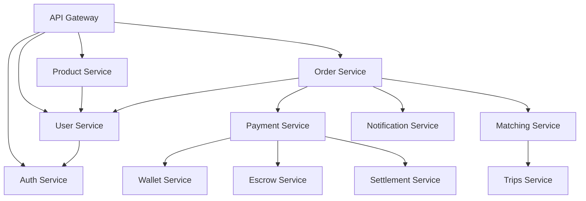

# 🗺️ خريطة التبعيات
## Mnbara Platform - Dependency Map

**تاريخ التحليل:** 2 مارس 2026

---

## 📦 التبعيات المشتركة

### JavaScript/TypeScript Libraries

#### Core Dependencies
```json
{
  "axios": "^1.7.9",          // HTTP client - مستخدم في 50+ موقع
  "lodash": "^4.17.21",       // Utilities - مستخدم في 40+ موقع
  "date-fns": "^4.1.0",       // Date utilities - مستخدم في 30+ موقع
  "rxjs": "^7.8.1"            // Reactive programming - مستخدم في 20+ موقع
}
```

#### Database
```json
{
  "prisma": "^6.2.1",         // ORM - مستخدم في 30+ خدمة
  "@prisma/client": "^6.2.1"
}
```

#### Development
```json
{
  "typescript": "^5.7.3",     // مستخدم في 40+ موقع
  "vitest": "^2.1.8",         // Testing
  "concurrently": "^9.1.2"    // Script runner
}
```

---

## 🔄 تحليل التكرار

### المكتبات المكررة بإصدارات مختلفة

#### axios
```
v1.6.0 - 10 مواقع
v1.6.8 - 15 موقع
v1.7.2 - 20 موقع
v1.7.9 - 10 مواقع
```
**المشكلة:** 4 إصدارات مختلفة  
**الحل:** توحيد على v1.7.9

#### typescript
```
v5.3.3 - 5 مواقع
v5.6.2 - 10 مواقع
v5.7.2 - 15 موقع
v5.7.3 - 15 موقع
```
**المشكلة:** 4 إصدارات مختلفة  
**الحل:** توحيد على v5.7.3

#### prisma
```
v5.19.1 - 10 مواقع
v6.0.0 - 5 مواقع
v6.2.1 - 15 موقع
```
**المشكلة:** 3 إصدارات مختلفة  
**الحل:** توحيد على v6.2.1

---

## 🔗 علاقات الخدمات

### Core Services Dependencies



---

## 📋 قائمة التبعيات الموصى بها

### للمشروع الموحد

```json
{
  "dependencies": {
    "axios": "^1.7.9",
    "date-fns": "^4.1.0",
    "lodash": "^4.17.21",
    "prisma": "^6.2.1",
    "@prisma/client": "^6.2.1",
    "rxjs": "^7.8.1"
  },
  "devDependencies": {
    "typescript": "^5.7.3",
    "vitest": "^2.1.8",
    "concurrently": "^9.1.2",
    "@types/node": "^20.x",
    "@types/lodash": "^4.x"
  }
}
```

---

## ✅ خطة توحيد التبعيات

### المرحلة 1: تحديث الإصدارات
1. تحديث جميع axios إلى v1.7.9
2. تحديث جميع typescript إلى v5.7.3
3. تحديث جميع prisma إلى v6.2.1

### المرحلة 2: إزالة التكرار
1. نقل التبعيات المشتركة إلى root
2. استخدام workspaces
3. حذف node_modules المكررة

### المرحلة 3: الاختبار
1. اختبار كل خدمة بعد التحديث
2. التأكد من عدم كسر التوافق
3. تحديث الاختبارات إذا لزم الأمر
