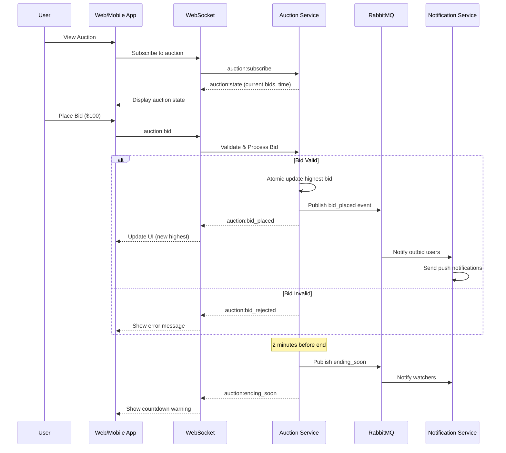
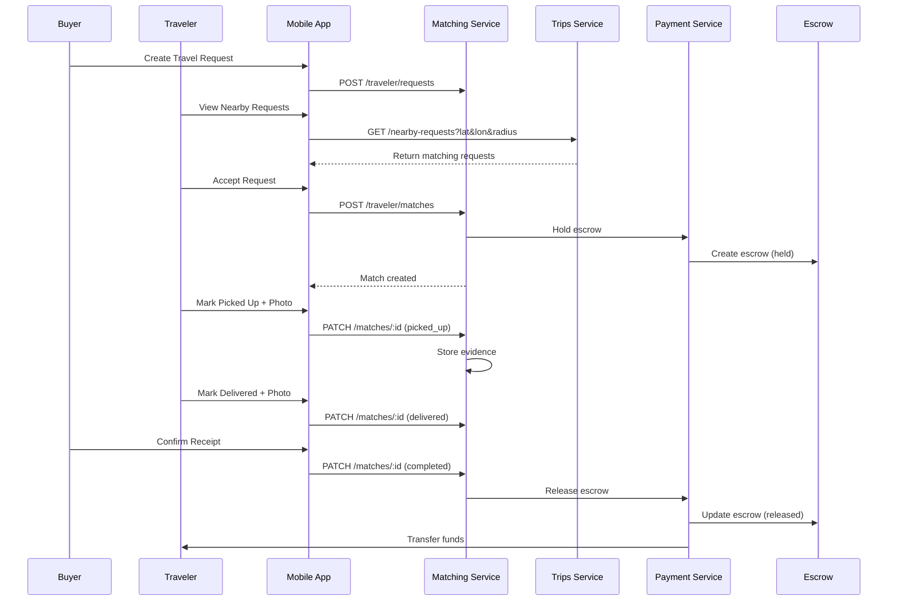
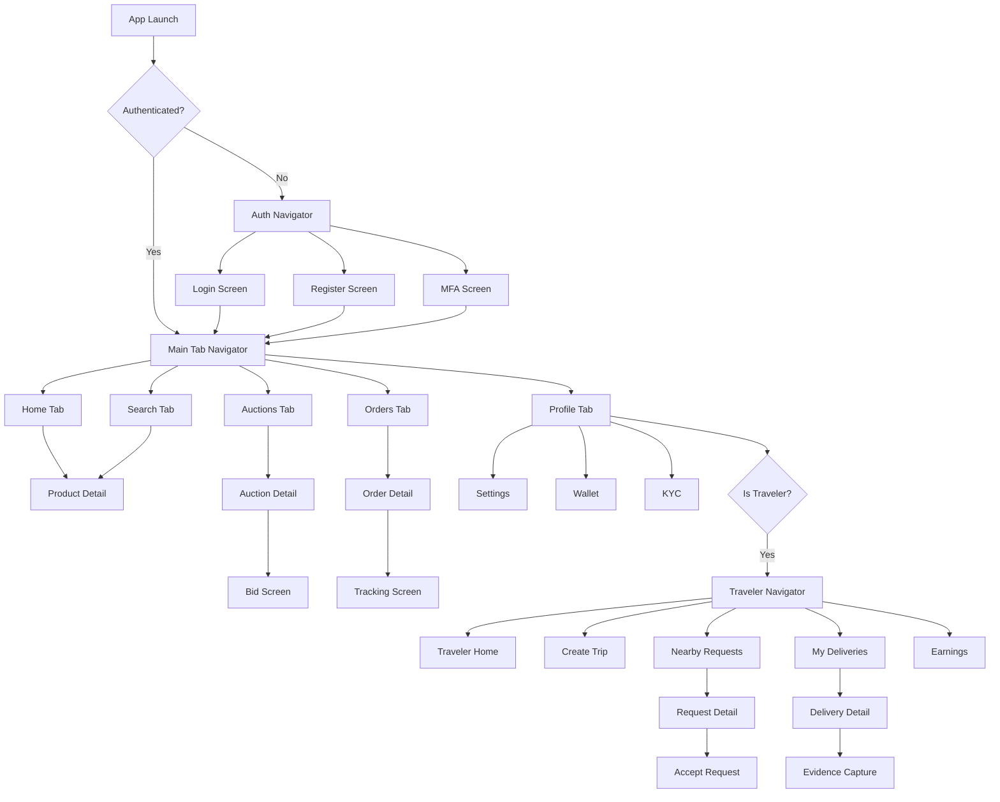

# Design Document - MNBARA Platform MVP Completion

## Overview

This design document outlines the architecture and implementation approach for completing the MNBARA e-commerce platform MVP. The platform already has a mature microservices backend with 14 services, blockchain smart contracts, and foundational frontend applications. This design focuses on completing frontend implementations, mobile app features, and integration gaps.

### Current Architecture Summary

```
┌─────────────────────────────────────────────────────────────────────────────┐
│                              MNBARA Platform                                 │
├─────────────────────────────────────────────────────────────────────────────┤
│  Frontend Layer                                                              │
│  ┌──────────────┐  ┌──────────────┐  ┌──────────────────┐                   │
│  │  Web App     │  │  Mobile App  │  │  Admin Dashboard │                   │
│  │  React/Vite  │  │ React Native │  │  React/Ant Design│                   │
│  │  TailwindCSS │  │  Zustand     │  │  Recharts        │                   │
│  └──────────────┘  └──────────────┘  └──────────────────┘                   │
├─────────────────────────────────────────────────────────────────────────────┤
│  API Gateway (Port 8080)                                                     │
├─────────────────────────────────────────────────────────────────────────────┤
│  Backend Services                                                            │
│  ┌─────────┐ ┌─────────┐ ┌─────────┐ ┌─────────┐ ┌─────────┐ ┌─────────┐   │
│  │  Auth   │ │ Listing │ │ Auction │ │ Payment │ │Crowdship│ │ Notif.  │   │
│  │  3001   │ │  3002   │ │  3003   │ │  3004   │ │  3005   │ │  3006   │   │
│  └─────────┘ └─────────┘ └─────────┘ └─────────┘ └─────────┘ └─────────┘   │
│  ┌─────────┐ ┌─────────┐ ┌─────────┐ ┌─────────┐ ┌─────────┐ ┌─────────┐   │
│  │ Recomm. │ │ Rewards │ │ Orders  │ │  Trips  │ │Matching │ │  Admin  │   │
│  │  3007   │ │  3008   │ │  3009   │ │  3010   │ │  3011   │ │  3012   │   │
│  └─────────┘ └─────────┘ └─────────┘ └─────────┘ └─────────┘ └─────────┘   │
├─────────────────────────────────────────────────────────────────────────────┤
│  Infrastructure                                                              │
│  ┌──────────┐ ┌──────────┐ ┌──────────┐ ┌──────────┐ ┌──────────┐          │
│  │PostgreSQL│ │  Redis   │ │ RabbitMQ │ │  MinIO   │ │Elasticsrch│          │
│  │ PostGIS  │ │  Cache   │ │  Queue   │ │ Storage  │ │  Search  │          │
│  └──────────┘ └──────────┘ └──────────┘ └──────────┘ └──────────┘          │
├─────────────────────────────────────────────────────────────────────────────┤
│  Blockchain Layer                                                            │
│  ┌──────────┐ ┌──────────┐ ┌──────────┐ ┌──────────┐ ┌──────────┐          │
│  │MNBToken  │ │MNBWallet │ │MNBEscrow │ │MNBExchange│ │MNBGovern │          │
│  └──────────┘ └──────────┘ └──────────┘ └──────────┘ └──────────┘          │
└─────────────────────────────────────────────────────────────────────────────┘
```

## Architecture

### Web Application Architecture

The web application uses React 19 with Vite, TailwindCSS 4, and React Router 7. The existing structure follows a feature-based organization:

```
frontend/web/src/
├── components/          # Reusable UI components
│   ├── auctions/       # Auction-specific components
│   ├── products/       # Product display components
│   ├── layout/         # Navigation, Footer, etc.
│   └── ui/             # Base UI components
├── pages/              # Route pages
│   ├── auctions/       # Auction pages
│   ├── auth/           # Login, Register
│   ├── cart/           # Cart, Checkout
│   ├── seller/         # Seller dashboard
│   ├── traveler/       # Traveler dashboard
│   └── admin/          # Admin pages
├── services/           # API and WebSocket services
├── context/            # React contexts
├── hooks/              # Custom hooks
├── types/              # TypeScript types
└── router/             # Route configuration
```

### Mobile Application Architecture

The mobile app uses React Native 0.73 with React Navigation 6 and Zustand for state management:

```
frontend/mobile/mnbara-app/
├── src/
│   ├── navigation/     # Navigation configuration
│   │   ├── RootNavigator.tsx
│   │   ├── AuthNavigator.tsx
│   │   ├── MainTabNavigator.tsx
│   │   └── TravelerNavigator.tsx
│   ├── screens/        # Screen components
│   │   ├── auth/       # Login, Register, MFA
│   │   ├── home/       # Home, Search, Categories
│   │   ├── auctions/   # Auction list, detail, bidding
│   │   ├── orders/     # Order list, tracking
│   │   ├── traveler/   # Trip management, deliveries
│   │   └── profile/    # User profile, settings
│   ├── components/     # Reusable components
│   ├── services/       # API services
│   ├── store/          # Zustand stores
│   └── theme/          # Restyle theme
└── App.tsx
```

### Admin Dashboard Architecture

The admin dashboard uses React 18 with Ant Design 5 and Recharts:

```
frontend/admin-dashboard/src/
├── components/         # Dashboard components
│   ├── charts/        # Analytics charts
│   ├── tables/        # Data tables
│   └── forms/         # Admin forms
├── pages/             # Admin pages
│   ├── Dashboard.tsx  # Main dashboard
│   ├── Users.tsx      # User management
│   ├── Disputes.tsx   # Dispute resolution
│   ├── KYC.tsx        # KYC approvals
│   └── Analytics.tsx  # Platform analytics
├── services/          # Admin API services
└── store/             # Zustand store
```

## Components and Interfaces

### Web Application Components

#### 1. Auction Components

```typescript
// components/auctions/AuctionCard.tsx
interface AuctionCardProps {
  auction: Auction;
  onBid?: () => void;
  onWatch?: () => void;
}

// components/auctions/BidPanel.tsx
interface BidPanelProps {
  auctionId: string;
  currentBid: number;
  minIncrement: number;
  endTime: Date;
  onBidPlaced: (amount: number) => void;
}

// components/auctions/AuctionTimer.tsx
interface AuctionTimerProps {
  endTime: Date;
  onEnd: () => void;
  showWarning?: boolean; // Show warning at 2 min
}

// components/auctions/BidHistory.tsx
interface BidHistoryProps {
  auctionId: string;
  bids: Bid[];
}
```

#### 2. Checkout Components

```typescript
// components/checkout/PaymentMethodSelector.tsx
interface PaymentMethodSelectorProps {
  methods: PaymentMethod[];
  selected: string;
  onSelect: (methodId: string) => void;
}

// components/checkout/EscrowInfo.tsx
interface EscrowInfoProps {
  amount: number;
  currency: string;
  releaseConditions: string[];
}

// components/checkout/OrderSummary.tsx
interface OrderSummaryProps {
  items: CartItem[];
  shipping: ShippingOption;
  escrow: boolean;
  total: number;
}
```

#### 3. Seller Dashboard Components

```typescript
// components/seller/ListingForm.tsx
interface ListingFormProps {
  product?: Product;
  onSubmit: (data: ListingFormData) => void;
  listingType: 'fixed' | 'auction';
}

// components/seller/SalesChart.tsx
interface SalesChartProps {
  data: SalesData[];
  period: 'day' | 'week' | 'month';
}

// components/seller/OrdersTable.tsx
interface OrdersTableProps {
  orders: Order[];
  onStatusUpdate: (orderId: string, status: OrderStatus) => void;
}
```

### Mobile Application Components

#### 1. Navigation Structure

```typescript
// navigation/RootNavigator.tsx
type RootStackParamList = {
  Auth: undefined;
  Main: undefined;
  Auction: { auctionId: string };
  Product: { productId: string };
  Order: { orderId: string };
  Trip: { tripId: string };
};

// navigation/MainTabNavigator.tsx
type MainTabParamList = {
  Home: undefined;
  Search: undefined;
  Auctions: undefined;
  Orders: undefined;
  Profile: undefined;
};

// navigation/TravelerNavigator.tsx
type TravelerStackParamList = {
  TravelerHome: undefined;
  CreateTrip: undefined;
  NearbyRequests: undefined;
  Deliveries: undefined;
  Earnings: undefined;
};
```

#### 2. Screen Components

```typescript
// screens/auctions/AuctionDetailScreen.tsx
interface AuctionDetailScreenProps {
  route: { params: { auctionId: string } };
}

// screens/traveler/NearbyRequestsScreen.tsx
interface NearbyRequestsScreenProps {
  // Uses device location to fetch nearby requests
}

// screens/traveler/DeliveryConfirmScreen.tsx
interface DeliveryConfirmScreenProps {
  route: { params: { matchId: string; type: 'pickup' | 'delivery' } };
}
```

### Service Interfaces

#### 1. API Service

```typescript
// services/api.ts
interface ApiService {
  // Auth
  login(email: string, password: string): Promise<AuthResponse>;
  register(data: RegisterData): Promise<AuthResponse>;
  refreshToken(): Promise<TokenResponse>;
  
  // Products & Listings
  getProducts(filters: ProductFilters): Promise<PaginatedResponse<Product>>;
  getProduct(id: string): Promise<Product>;
  createListing(data: ListingData): Promise<Listing>;
  
  // Auctions
  getAuctions(filters: AuctionFilters): Promise<PaginatedResponse<Auction>>;
  getAuction(id: string): Promise<AuctionDetail>;
  placeBid(auctionId: string, amount: number): Promise<BidResponse>;
  
  // Orders
  createOrder(data: OrderData): Promise<Order>;
  getOrders(): Promise<Order[]>;
  getOrder(id: string): Promise<OrderDetail>;
  
  // Traveler
  createTrip(data: TripData): Promise<Trip>;
  getNearbyRequests(lat: number, lon: number, radiusKm: number): Promise<TravelRequest[]>;
  updateMatchStatus(matchId: string, status: MatchStatus, evidence?: Evidence): Promise<Match>;
  
  // Payments
  createPaymentIntent(orderId: string): Promise<PaymentIntent>;
  confirmPayment(intentId: string, paymentData: PaymentData): Promise<PaymentResult>;
}
```

#### 2. WebSocket Service (Existing - Enhanced)

```typescript
// services/websocket.ts - Enhanced auction events
interface AuctionWebSocketEvents {
  // Outgoing
  'auction:subscribe': { auctionId: string };
  'auction:bid': { auctionId: string; amount: number };
  'auction:proxy_bid': { auctionId: string; maxAmount: number };
  
  // Incoming
  'auction:state': AuctionState;
  'auction:bid_placed': { auctionId: string; bid: Bid; newHighest: number };
  'auction:bid_rejected': { auctionId: string; reason: string };
  'auction:ending_soon': { auctionId: string; secondsRemaining: number };
  'auction:ended': { auctionId: string; winner: User; finalPrice: number };
  'auction:outbid': { auctionId: string; newHighest: number };
}
```

## Data Models

### Frontend State Models

```typescript
// types/index.ts

interface User {
  id: string;
  email: string;
  phone?: string;
  fullName: string;
  role: 'buyer' | 'seller' | 'traveler' | 'admin';
  kycStatus: 'none' | 'pending' | 'verified' | 'rejected';
  ratingAvg: number;
  avatarUrl?: string;
  createdAt: string;
}

interface Product {
  id: string;
  sellerId: string;
  title: string;
  description: string;
  categoryId: string;
  price: number;
  currency: string;
  condition: 'new' | 'like_new' | 'good' | 'fair';
  images: string[];
  attributes: Record<string, string>;
  status: 'draft' | 'active' | 'sold' | 'archived';
}

interface Listing {
  id: string;
  productId: string;
  product: Product;
  type: 'fixed' | 'auction';
  startPrice?: number;
  reservePrice?: number;
  buyItNowPrice?: number;
  currentPrice: number;
  startAt: string;
  endAt: string;
  status: 'scheduled' | 'active' | 'ended' | 'sold';
  viewsCount: number;
  bidsCount?: number;
}

interface Auction extends Listing {
  type: 'auction';
  highestBid?: Bid;
  bids: Bid[];
  autoExtend: boolean;
  extensionMinutes: number;
}

interface Bid {
  id: string;
  auctionId: string;
  bidderId: string;
  bidder: { id: string; name: string; rating: number };
  amount: number;
  isProxy: boolean;
  createdAt: string;
}

interface Order {
  id: string;
  buyerId: string;
  sellerId: string;
  listingId: string;
  listing: Listing;
  pricePaid: number;
  currency: string;
  status: 'pending' | 'paid' | 'shipped' | 'delivered' | 'disputed' | 'refunded';
  escrow: boolean;
  escrowStatus?: 'held' | 'released' | 'refunded';
  trackingNumber?: string;
  createdAt: string;
}

interface Trip {
  id: string;
  travelerId: string;
  origin: string;
  destination: string;
  departAt: string;
  arriveAt: string;
  capacityKg: number;
  availableKg: number;
  status: 'scheduled' | 'in_progress' | 'completed' | 'cancelled';
}

interface TravelRequest {
  id: string;
  buyerId: string;
  productId: string;
  product: Product;
  destination: string;
  deadline: string;
  budget: number;
  status: 'open' | 'matched' | 'in_progress' | 'completed' | 'cancelled';
  distanceKm?: number; // Calculated from traveler location
}

interface TravelMatch {
  id: string;
  tripId: string;
  requestId: string;
  trip: Trip;
  request: TravelRequest;
  status: 'proposed' | 'accepted' | 'picked_up' | 'delivered' | 'completed' | 'cancelled';
  pickupEvidence?: Evidence;
  deliveryEvidence?: Evidence;
}

interface Evidence {
  photoUrl: string;
  timestamp: string;
  location?: { lat: number; lon: number };
}
```

### Zustand Store Models (Mobile)

```typescript
// store/authStore.ts
interface AuthStore {
  user: User | null;
  token: string | null;
  isAuthenticated: boolean;
  login: (email: string, password: string) => Promise<void>;
  logout: () => void;
  refreshToken: () => Promise<void>;
}

// store/auctionStore.ts
interface AuctionStore {
  activeAuctions: Map<string, AuctionState>;
  subscribeToAuction: (auctionId: string) => void;
  unsubscribeFromAuction: (auctionId: string) => void;
  placeBid: (auctionId: string, amount: number) => Promise<void>;
  setProxyBid: (auctionId: string, maxAmount: number) => Promise<void>;
}

// store/travelerStore.ts
interface TravelerStore {
  trips: Trip[];
  activeDeliveries: TravelMatch[];
  nearbyRequests: TravelRequest[];
  currentLocation: { lat: number; lon: number } | null;
  fetchTrips: () => Promise<void>;
  createTrip: (data: TripData) => Promise<void>;
  fetchNearbyRequests: () => Promise<void>;
  updateLocation: (lat: number, lon: number) => Promise<void>;
  acceptRequest: (requestId: string) => Promise<void>;
  submitEvidence: (matchId: string, type: 'pickup' | 'delivery', evidence: Evidence) => Promise<void>;
}
```

## Error Handling

### API Error Handling

```typescript
// services/api.ts
interface ApiError {
  code: string;
  message: string;
  details?: Record<string, string[]>;
}

class ApiErrorHandler {
  static handle(error: AxiosError<ApiError>): never {
    const apiError = error.response?.data;
    
    switch (error.response?.status) {
      case 401:
        // Token expired - attempt refresh or redirect to login
        authService.refreshToken().catch(() => authService.logout());
        break;
      case 403:
        // Forbidden - show permission error
        throw new ForbiddenError(apiError?.message || 'Access denied');
      case 422:
        // Validation error - show field errors
        throw new ValidationError(apiError?.details || {});
      case 429:
        // Rate limited - show retry message
        throw new RateLimitError('Too many requests. Please try again later.');
      default:
        throw new ApiError(apiError?.message || 'An unexpected error occurred');
    }
  }
}
```

### WebSocket Error Handling

```typescript
// services/websocket.ts
class WebSocketErrorHandler {
  static handleBidRejection(reason: string): string {
    const messages: Record<string, string> = {
      'bid_too_low': 'Your bid must be higher than the current bid',
      'auction_ended': 'This auction has ended',
      'insufficient_funds': 'Insufficient wallet balance',
      'user_blocked': 'You are not allowed to bid on this auction',
    };
    return messages[reason] || reason;
  }
}
```

### Mobile Error Boundaries

```typescript
// components/ErrorBoundary.tsx
class ErrorBoundary extends React.Component<Props, State> {
  static getDerivedStateFromError(error: Error): State {
    return { hasError: true, error };
  }

  componentDidCatch(error: Error, errorInfo: ErrorInfo) {
    // Log to Sentry or similar
    Sentry.captureException(error, { extra: errorInfo });
  }

  render() {
    if (this.state.hasError) {
      return <ErrorFallback error={this.state.error} onRetry={this.handleRetry} />;
    }
    return this.props.children;
  }
}
```

## Testing Strategy

### Unit Testing

- **Web App**: Vitest + React Testing Library (existing setup)
- **Mobile App**: Jest + React Native Testing Library
- **Focus Areas**: 
  - Service functions (API calls, data transformations)
  - Custom hooks (useCart, useAuction, useTraveler)
  - Utility functions (price formatting, date handling)

### Integration Testing

- **API Integration**: Test service layer against mock server
- **WebSocket Integration**: Test real-time auction flows
- **Payment Integration**: Test Stripe/PayPal flows in sandbox

### E2E Testing

- **Web**: Playwright for critical user flows
- **Mobile**: Detox for React Native E2E
- **Critical Flows**:
  - User registration and login
  - Product search and purchase
  - Auction bidding flow
  - Traveler trip creation and delivery

### Test File Structure

```
frontend/web/src/
├── services/__tests__/
│   ├── api.service.test.ts
│   ├── auth.service.test.ts
│   └── websocket.test.ts
├── hooks/__tests__/
│   ├── useCart.test.ts
│   └── useAuction.test.ts
└── components/__tests__/
    ├── AuctionCard.test.tsx
    └── BidPanel.test.tsx

frontend/mobile/mnbara-app/
├── __tests__/
│   ├── screens/
│   └── services/
└── e2e/
    ├── auth.e2e.ts
    └── auction.e2e.ts
```

## Diagrams

### Auction Bidding Flow



### Traveler Delivery Flow



### Mobile App Navigation Flow


