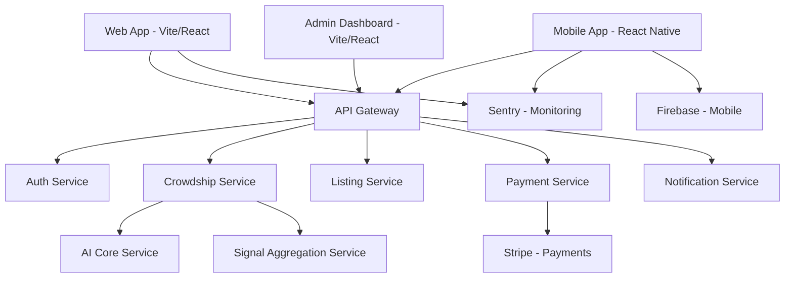

# 🗺️ خريطة تكامل خدمات MNBARA Platform

## 📋 نظرة عامة

هذه الخريطة توضح كيفية اتصال جميع الخدمات والمكونات في منصة MNBARA مع بعضها البعض.

## 🔗 اتصالات الخدمات الرئيسية

## 📊 تفاصيل التكامل

### 1. 🔐 خدمة المصادقة (Auth Service)
**المستهلكون:**
- جميع التطبيقات الأمامية (Web, Mobile, Admin)
- API Gateway للتحقق من التوكنات

**الواجهات:**
- `POST /api/auth/login` - تسجيل الدخول
- `POST /api/auth/register` - إنشاء حساب
- `GET /api/auth/me` - بيانات المستخدم
- `POST /api/auth/refresh` - تجديد التوكن

### 2. 🤖 خدمة الحشد (Crowdship Service)
**المستهلكون:**
- تطبيقات المستخدمين (Web, Mobile)
- لوحة التحكم الإدارية

**الواجهات الرئيسية:**
- `POST /api/crowdship/offers` - إنشاء طلب شحنة
- `GET /api/crowdship/offers/:id` - تفاصيل الطلب
- `GET /api/crowdship/offers/:id/ai/recommendation` - توصيات الذكاء الاصطناعي
- `POST /api/crowdship/corridor/advisory` - تقييم الممرات

### 3. 🧠 نواة الذكاء الاصطناعي (AI Core Service)
**المستهلكون:**
- Crowdship Service فقط (داخلي)

**الواجهات الداخلية:**
- `POST /api/ai-core/intent/classify` - تصنيف النية
- `POST /api/ai-core/trust/compute` - حساب درجة الثقة
- `POST /api/ai-core/risk/assess` - تقييم المخاطر
- `POST /api/ai-core/match/users` - مطابقة المستخدمين

### 4. 📡 خدمة تجميع الإشارات (Signal Aggregation Service)
**المستهلكون:**
- Crowdship Service
- AI Core Service

**الواجهات:**
- `GET /health` - حالة الخدمة
- `GET /info` - معلومات الخدمة
- `GET /thresholds` - العتبات
- `GET /signals/:corridor/:timeBucket` - الإشارات حسب الممر

### 5. 🛒 خدمة القوائم (Listing Service)
**المستهلكون:**
- تطبيقات المستخدمين
- خدمة البحث

**الواجهات:**
- `GET /api/v1/listings` - الحصول على القوائم
- `GET /api/v1/listings/:id` - تفاصيل القائمة
- `POST /api/v1/listings` - إنشاء قائمة جديدة

## 🔐 سياسات الأمان والوصول

### 1. التحكم في الوصول
- **التطبيقات الأمامية**: وصول محدود للواجهات العامة فقط
- **الخدمات الداخلية**: اتصال مباشر بين الخدمات فقط
- **الواجهات الإدارية**: تتطلب صلاحيات مسؤول

### 2. حدود المعدل (Rate Limiting)
| الخدمة | الحد الأقصى | الفترة |
|--------|------------|--------|
| البحث | 60 طلب/دقيقة | لكل IP |
| القوائم | 120 طلب/دقيقة | لكل IP |
| التوصيات | 30 طلب/دقيقة | لكل مستخدم |
| العروض | 10 طلب/دقيقة | لكل مستخدم |

### 3. أوقات الاستجابة المستهدفة
| النسبة المئوية | البحث | القوائم | التوصيات | العروض |
|----------------|--------|---------|----------|--------|
| p50 | 150ms | 80ms | 400ms | 250ms |
| p95 | 400ms | 250ms | 1200ms | 800ms |
| p99 | 800ms | 500ms | 2000ms | 1500ms |

## 🚀 نمط النشر

### 1. التطبيقات الأمامية
- **Web App**: Vite + React → Vercel/Netlify
- **Mobile App**: React Native → App Store/Play Store
- **Admin Dashboard**: Vite + React → نفس نطاق API

### 2. الخدمات الخلفية
- كل خدمة في حاوية Docker منفصلة
- إدارة عبر Kubernetes
- خدمة API Gateway توجه الطلبات للخدمات المناسبة

### 3. قواعد البيانات
- كل خدمة لها قاعدة بيانات منفصلة
- اتصال مباشر بين الخدمة وقاعدة بياناتها فقط
- لا اتصال مباشر بين قواعد البيانات

## 📋 حالة التكامل الحالية

### ✅ مكتمل ويعمل:
- تكامل Auth Service مع جميع التطبيقات
- تكامل Crowdship Service مع AI Core
- تكامل الإشارات مع Signal Aggregation Service
- تكامل المراقبة مع Sentry

### 🚧 قيد التطوير:
- تكامل الدفع الكامل مع Stripe
- تكامل الإشعارات الفورية
- تكامل البحث المتقدم

### 📅 مخطط للمستقبل:
- تكامل المحفظة الرقمية
- تكامل التقييمات والمراجعات
- تكامل التحليلات المتقدمة

## 🔧 أدوات التطوير والمراقبة

### 1. المراقبة
- **Sentry**: تتبع الأخطاء والأداء
- **Custom Metrics**: مقاييس أداء مخصصة
- **Health Checks**: فحوصات صحة الخدمات

### 2. التطوير
- **API Gateway**: توجيه الطلبات أثناء التطوير
- **Mock Services**: خدمات وهمية للتطوير
- **Local Docker**: حاويات محلية للاختبار

---

*آخر تحديث: ديسمبر 2025*  
*الإصدار: 2.0*  
*مسؤول الخريطة: فريق الهندسة*