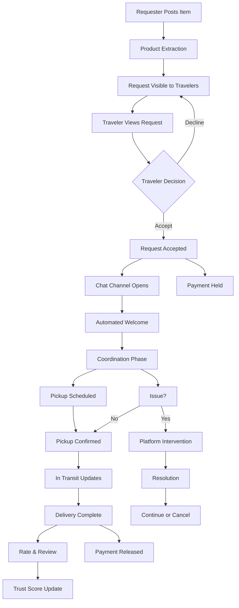

# UX Flow Diagram - Crowdshipping Communication

---

## 🔄 Complete User Journey



---

## 📱 Screen-by-Screen Flow

### **1. Request Discovery (Traveler)**
```
┌─────────────────────────────────┐
│  🌍 Available Requests          │
│  ─────────────────────────────  │
│  📦 iPhone 15 Pro Max           │
│     $1,199 • USA → Kenya        │
│     ⏰ 7 days remaining         │
│                                 │
│  👤 Sarah T.                    │
│     ⭐ 4.8 • 23 deliveries      │
│     ✅ Platform Verified        │
│                                 │
│  [View Details] [Accept]        │
└─────────────────────────────────┘
```

### **2. Request Details**
```
┌─────────────────────────────────┐
│  📦 Request Details             │
│  ─────────────────────────────  │
│  Product: iPhone 15 Pro Max     │
│  Price: $1,199                  │
│  Origin: Minneapolis, USA      │
│  Destination: Nairobi, Kenya    │
│  Deadline: Dec 25, 2024        │
│                                 │
│  📝 Special Instructions:       │
│  "Handle with care, original    │
│   box required"                 │
│                                 │
│  👤 Requester: John D.          │
│     ⭐ 4.9 • 15 requests        │
│     ✅ Verified since 2023      │
│                                 │
│  [Accept Request] [Pass]        │
└─────────────────────────────────┘
```

### **3. Chat Interface (Post-Acceptance)**
```
┌─────────────────────────────────┐
│  💬 John D. ↔ Sarah T.          │
│  ─────────────────────────────  │
│  🤖 Mnbarh Bot                  │
│  Welcome! Request accepted.     │
│  Please coordinate pickup.      │
│                                 │
│  👤 John D.     2:15 PM         │
│  Hi Sarah! Thanks for accepting │
│  my request. When can you      │
│  pick up the iPhone?            │
│                                 │
│  👤 Sarah T.    2:18 PM         │
│  Hi John! I can pick it up      │
│  tomorrow at 2 PM from the      │
│  Apple Store. Does that work?   │
│                                 │
│  [Type message...]              │
│  📎 📍 📷                       │
└─────────────────────────────────┘
```

### **4. Status Timeline**
```
┌─────────────────────────────────┐
│  📈 Delivery Progress           │
│  ─────────────────────────────  │
│                                 │
│  ✅ Request Created             │
│     Dec 18, 2024 • 10:00 AM    │
│                                 │
│  ✅ Traveler Found              │
│     Dec 18, 2024 • 2:15 PM     │
│                                 │
│  ✅ Pickup Scheduled            │
│     Dec 19, 2024 • 2:00 PM     │
│     Apple Store, Mall of America│
│                                 │
│  ⏳ Pickup Confirmed            │
│     Pending...                  │
│                                 │
│  ⏳ In Transit                   │
│     Pending...                  │
│                                 │
│  ⏳ Delivered                    │
│     Pending...                  │
└─────────────────────────────────┘
```

---

## 🎯 Key Interaction Points

### **Critical Trust Moments**

1. **Acceptance Decision**
   - Clear traveler credentials
   - Transparent request details
   - Platform protection visible

2. **First Contact**
   - Automated safety message
   - Verification prompts
   - Communication guidelines

3. **Pickup Coordination**
   - Location sharing
   - Time confirmation
   - Item verification

4. **Delivery Confirmation**
   - Photo evidence
   - Both-party confirmation
   - Payment release

### **Risk Mitigation Touchpoints**

```
🛡️ Protection Layers:
┌─────────────────────────────────┐
│ 1. Identity Verification         │
│ 2. Payment Holding              │
│ 3. Chat Monitoring              │
│ 4. Status Tracking             │
│ 5. Review System               │
│ 6. Dispute Resolution          │
└─────────────────────────────────┘
```

---

## 📱 Mobile-First Design

### **Thumb Zone Optimization**
```
┌─────────────────────────────────┐
│  [Back] Chat with John D.       │
│  ─────────────────────────────  │
│  📱 Scrollable Chat Area        │
│                                 │
│  💬 Message bubbles...          │
│                                 │
│  💬 Message bubbles...          │
│                                 │
│  💬 Message bubbles...          │
│                                 │
│  ─────────────────────────────  │
│  📎 📍 📷 [Type message...] 📤 │
└─────────────────────────────────┘
```

### **Quick Actions Bar**
```
┌─────────────────────────────────┐
│  🚀 Quick Actions               │
│  ─────────────────────────────  │
│  📍 Share Location             │
│  📷 Send Photo                  │
│  ⏰ Schedule Pickup             │
│  📞 Call Support                │
│  🚨 Report Issue                │
└─────────────────────────────────┘
```

---

## 🌐 Multi-Language Support

### **Language Toggle**
```
┌─────────────────────────────────┐
│  🌐 Language                    │
│  ─────────────────────────────  │
│  🇺🇸 English                    │
│  🇸🇦 العربية                    │
│  🇰🇪 Kiswahili                  │
│  🇫🇷 Français                   │
└─────────────────────────────────┘
```

### **RTL Layout (Arabic)**
```
┌─────────────────────────────────┐
│  💬 محادثة مع جون د.            │
│  ─────────────────────────────  │
│  🤖 بوت منبره                   │
│  مرحبا! تم قبول الطلب.           │
│  يرجى تنسيق الاستلام.           │
│                                 │
│  👤 جون د.      2:15 م          │
│  مرحبا سارة! شكرا لقبول          │
│  طلبي. متى يمكنك استلام          │
│  الآيفون؟                       │
│                                 │
│  [اكتب رسالة...] 📤             │
└─────────────────────────────────┘
```

---

## 🎨 Visual Hierarchy

### **Information Priority**
1. **Safety First** - Trust badges, verification status
2. **Action Required** - Next steps, deadlines
3. **Context** - Request details, participant info
4. **Support** - Help options, contact info

### **Color Psychology**
- 🟢 **Green** - Success, completion, safety
- 🔵 **Blue** - Trust, communication, information
- 🟡 **Yellow** - Attention, pending, caution
- 🔴 **Red** - Urgent, issues, cancellation
- 🟣 **Purple** - Premium, verification
- 🟠 **Orange** - Action, urgency

---

## 📊 Success Metrics Dashboard

### **User Trust Score**
```
┌─────────────────────────────────┐
│  🏆 Trust Score                 │
│  ─────────────────────────────  │
│                                 │
│  ⭐ Overall: 4.8/5.0            │
│                                 │
│  📊 Components:                 │
│  • Completion Rate: 98%        │
│  • Response Time: 1.2 hrs      │
│  • Rating Quality: 4.9         │
│  • Dispute Rate: 0.5%          │
│                                 │
│  📈 Trend: ↗️ Improving         │
└─────────────────────────────────┘
```

### **Communication Health**
```
┌─────────────────────────────────┐
│  💬 Communication Health         │
│  ─────────────────────────────  │
│                                 │
│  📞 Response Rate: 95%          │
│  ⏱️ Avg Response: 1.2 hours    │
│  💬 Message Quality: 4.7/5     │
│  🤝 Coordination Success: 96%  │
│                                 │
│  🎯 Status: Excellent           │
└─────────────────────────────────┘
```

This flow ensures clear communication, builds trust through transparency, and provides safety nets at every critical interaction point.
