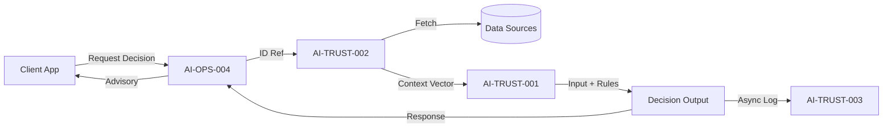

# AI Trust Operating System: Runtime Architecture Pack

**Document ID:** ARCH-AI-TRUST-RUNTIME-001
**Classification:** Technical Architecture / System Design
**Version:** 1.0
**Status:** APPROVED

---

## 1. Runtime Components Inventory

The system is composed of six isolated, stateless runtime components designed for deterministic execution and maximal auditability.

*   **AI-TRUST-001: Policy Execution Engine (PEE)**
    *   **Role:** The deterministic "brain" of the system.
    *   **Function:** Executes static logic rules against provided input vectors.
    *   **Constraint:** No external I/O, no DB access, no learning. Pure function `f(input, rules) -> decision`.
    *   **Type:** Stateless Compute.

*   **AI-TRUST-002: Context Assembler (CA)**
    *   **Role:** The data aggregator.
    *   **Function:** Fetches, normalizes, and sanitizes data from upstream services (KYC, Transaction History, Device Fingerprint).
    *   **Constraint:** Read-only access to source systems. Fails safe if data sources are down.
    *   **Type:** I/O Orchestrator.

*   **AI-TRUST-003: Immutable Audit Logger (IAL)**
    *   **Role:** The "Black Box" flight recorder.
    *   **Function:** Asynchronously writes every input, rule version, and decision output to WORM (Write-Once-Read-Many) storage.
    *   **Constraint:** Non-blocking. System proceeds even if logging encounters latency (queued).
    *   **Type:** Event Ingestion.

*   **AI-OPS-004: Decision Gateway API**
    *   **Role:** The trusted interface.
    *   **Function:** Exposes REST/gRPC endpoints for client applications (e.g., Payment Gateway, Onboarding UI).
    *   **Constraint:** Enforces authentication and rate limiting. Strips internal sensitive context from responses.
    *   **Type:** API Facade.

*   **AI-OPS-005: Shadow Evaluator**
    *   **Role:** The safety harness.
    *   **Function:** Runs candidate rule sets (vNext) in parallel with active rules (vCurrent) to measure deviation without affecting production decisions.
    *   **Type:** Background Process.

*   **AI-OPS-006: Health & Integrity Monitor**
    *   **Role:** The watchdog.
    *   **Function:** Monitors real-time drifts in decision distribution (e.g., "Why did rejection rate spike 500% in 5 minutes?").
    *   **Type:** Telemetry & Alerting.

---

## 2. Data Flow Architecture

---

## 3. Request Lifecycle (Input → Decision → Audit)

1.  **Ingestion:**
    *   API Gateway receives `POST /assess/transaction`. Payload contains reference IDs (e.g., `transaction_id`, `user_id`).
    *   Gateway validates schema and authenticates the calling service.

2.  **Assembly:**
    *   Context Assembler fetches required signals: User KYC Status, Velocity (Last 24h), IP Reputation.
    *   Data is normalized into a flat `ContextVector` JSON (e.g., `{ "velocity_24h": 5000, "kyc_level": 2 }`).

3.  **Evaluation:**
    *   Policy Engine loads specific Rule Set (hash-verified).
    *   Rules are applied sequentially or in parallelDAGs.
    *   Result generated: `RiskScore` (0-100) and `ReasonCodes` (["VELOCITY_HIGH"]).

4.  **Audit:**
    *   Request ID, Context Vector (hashed PII), Rule Version, and Result are pushed to the Audit Queue.

5.  **Response:**
    *   Gateway returns the decision to the synchronous caller within < 200ms.

---

## 4. Read-Only Boundaries & Non-Enforcement Guarantees

*   **Advisory Nature:** The system **never** executes a block, freeze, or money movement directly. It returns a `decision_recommendation`. The calling service (e.g., Payment Switch) is responsible for enforcement.
*   **No Write Access:** The Context Assembler has strictly `READ` permissions on upstream databases. It physically cannot mutate user data or transaction states.
*   **Isolation:** The Policy Engine runs in an ephemeral container with no network access to the outside world, ensuring no leakage of decision logic.

---

## 5. Failure Handling & Resilience

*   **Missing Data (Null/Partial Input):**
    *   Each rule defines a strict `on_missing` behavior:
        *   *Conservative:* Treat missing data as High Risk.
        *   *Permissive:* Find decision based on available data only (degrade confidence score).
    *   **Default:** Logic defaults to "Manual Review" if critical signals (e.g., KYC status) are unreachable.

*   **Timeouts:**
    *   If Context Assembly takes > 150ms, the operation aborts.
    *   **Fail-Open vs Fail-Closed:** Configurable per use-case.
        *   *Logins:* Fail-Open (Allow with flagged session).
        *   *High-Value Transfers:* Fail-Closed (Reject and ask to retry).

*   **Circuit Breakers:**
    *   Automatic bypass if Error Rate > 5%. The system enters "Passthrough Mode" (logging only) to prevent blocking business operations during outages.

---

## 6. Determinism Guarantees

*   **Pure Functions:** The Policy Engine contains no random seeds, no timestamps (externalized), and no state.
    *   `f(Context_A, RuleSet_V1) = Result_X` **Always**, today, tomorrow, or in 10 years.
*   **Version Pinning:** Every request is tied to a specific immutable Rule Set version.
*   **Regression Suites:** Every deployment simulates 100,000 historical requests to verify bit-perfect output consistency before traffic shifting.

---

## 7. Performance & Scaling Assumptions

*   **Latency:** P99 target is < 200ms (end-to-end).
*   **Throughput:** Horizontally scalable Stateless Workers. 2 vCPUs can handle ~500 decisions/sec.
*   **Caching:** Context Assembler uses short-lived (5s) TTL for high-frequency signals to reduce DB load during attacks.
*   **Concurrency:** Non-blocking I/O for data fetching; CPU-bound execution for rule evaluation.

---

**Architectural Sign-off:**
Principal Systems Architect
Date: 2025-12-17
