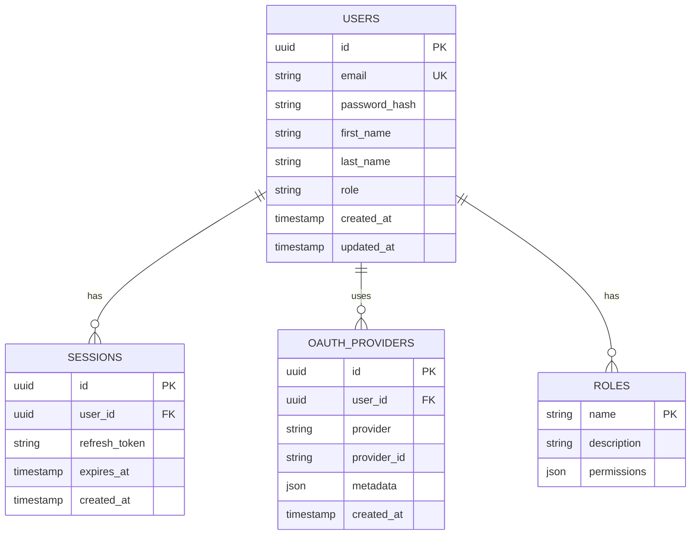
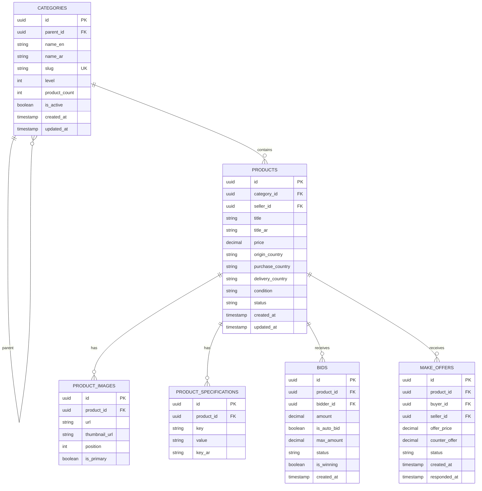
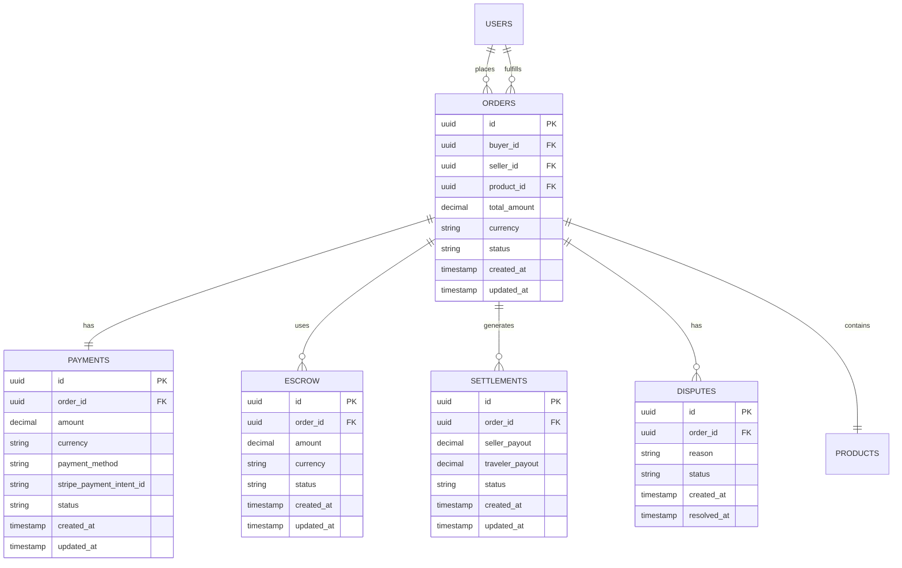
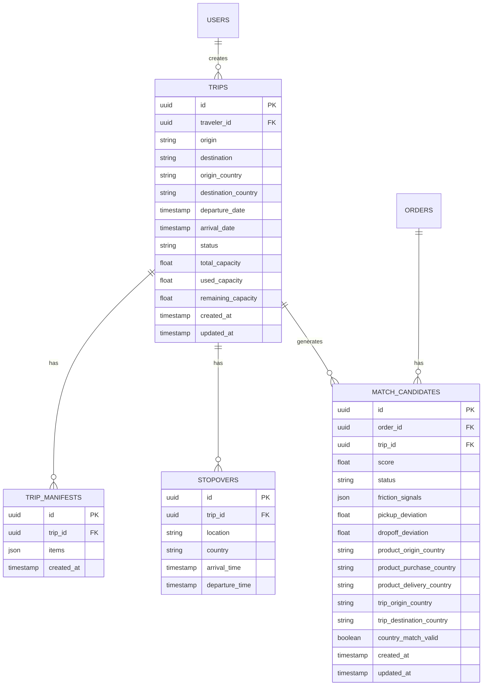
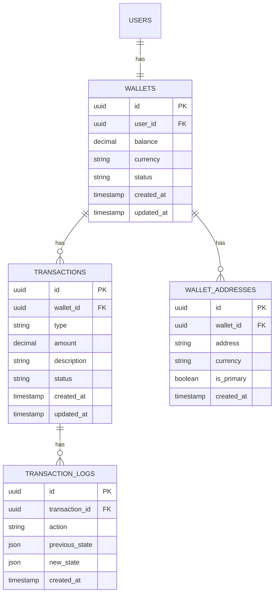
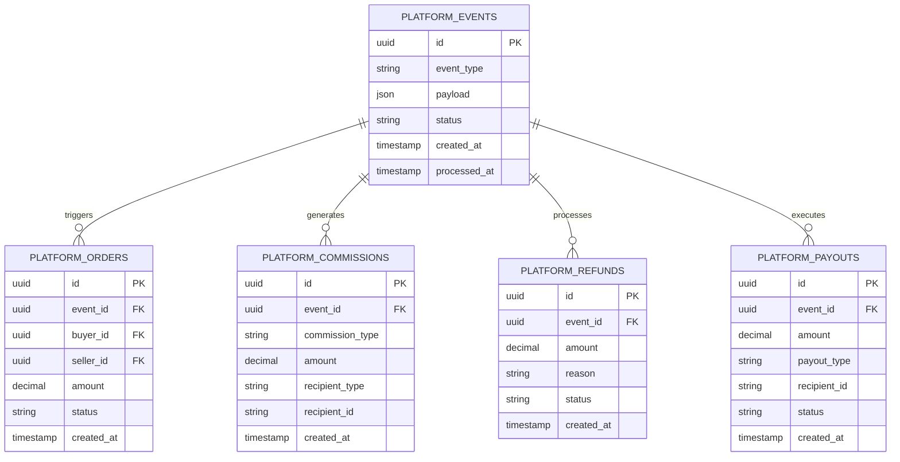
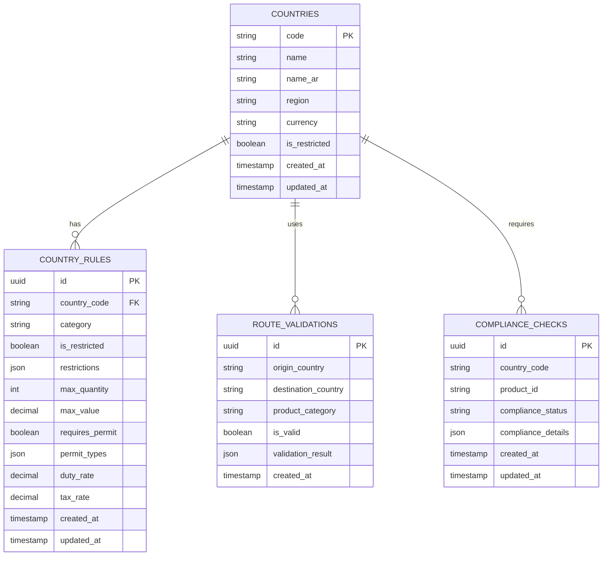
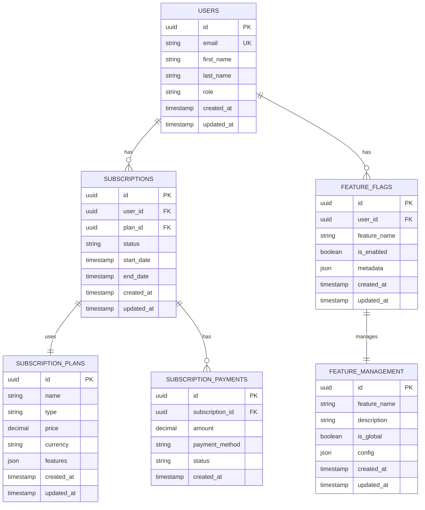
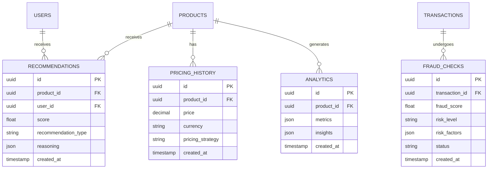

# Entity Relationship Diagrams (ERD)

Database schemas and relationships for all Mnbara Platform services.

---

## Core Services ERD

### Users & Authentication

### Products & Categories

### Orders & Payments

### Trips & Matching

### Wallet & Financial

---

## Platform Events ERD

---

## Country Layer ERD

---

## Subscription & Feature Management ERD

---

## AI Services ERD

---

**Status**: ✅ ERD Generated
**Next**: API Documentation
