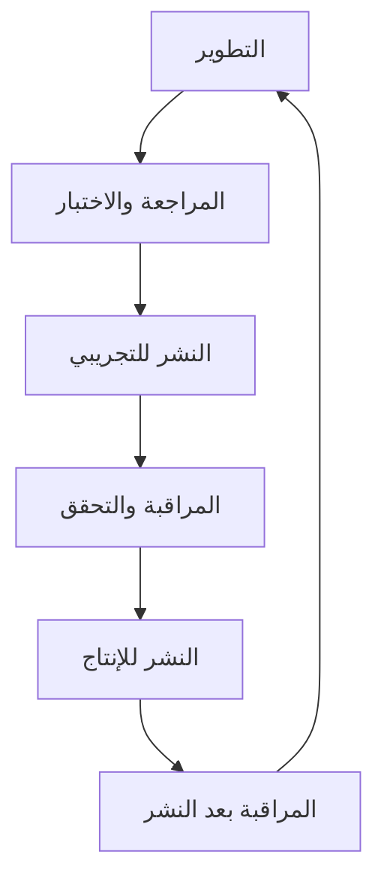

# قائمة التحقق لنشر واجهة مركز التحكم

## 📋 نظرة عامة
هذه القائمة تضمن نشرًا آمنًا وموثوقًا لواجهة مركز التحكم مع الحفاظ على استمرارية الخدمة والأمان.

### 🔄 دورة النشر


## ✅ قبل النشر

### 1. التحقق من الجودة
- [ ] **جميع الاختبارات تمر** (`npm test`)
- [ ] **لا توجد أخطاء TypeScript** (`npm run typecheck`)
- [ ] **التزام بمعايير ESLint** (`npm run lint`)
- [ ] **التغطية بالاختبارات ≥ 80%** (`npm run test:coverage`)

### 2. المراجعة الأمنية
- [ ] **فحص تبعيات الأمان** (`npm audit`)
- [ ] **مراجعة صلاحيات RBAC** الجديدة
- [ ] **تحقق من إعدادات CORS**
- [ ] **مراجعة متغيرات البيئة الحساسة**

### 3. التوثيق
- [ ] **تحديث README** مع التغييرات الجديدة
- [ ] **توثيق API** محدث (إذا هناك تغييرات)
- [ ] **إرشادات الترقية** مضافة
- [ ] **سجل التغييرات** (CHANGELOG) محدث

### 4. البنية التحتية
- [ ] **قاعدة البيانات**: migrations تعمل بشكل صحيح
- [ ] **Redis**: التهيئة صحيحة
- [ ] **RabbitMQ**: التكوين صحيح
- [ ] **التخزين**: إعدادات S3/MinIO صحيحة

## 🚀 عملية النشر

### للنشر على البيئة التجريبية (Staging)
```bash
# 1. بناء الصورة
npm run build:staging

# 2. اختبار محلي للبناء
npm run serve:staging

# 3. النشر
npm run deploy:staging

# 4. التحقق من النشر
npm run healthcheck:staging
```

### للنشر على البيئة الإنتاجية (Production)
```bash
# 1. بناء الإنتاج
npm run build:production

# 2. الاختبار النهائي
npm run test:production

# 3. النشر مع Zero Downtime
npm run deploy:production -- --strategy=rolling

# 4. التحقق من التوفر
npm run healthcheck:production
```

## 🔍 بعد النشر

### 1. المراقبة الفورية (أول 30 دقيقة)
- [ ] **أخطاء 5xx** ≤ 0.1% من الطلبات
- [ **زمن الاستجابة** < 500ms للنسبة المئوية 95
- [ ] **استخدام الذاكرة** < 80% من الحد
- [ ] **استخدام CPU** < 70% من الحد

### 2. التحقق الوظيفي
- [ ] **مركز التحكم**: يمكن الوصول إلى `/admin`
- [ ] **المصادقة**: تسجيل الدخول يعمل
- [ ] **الصلاحيات**: RBAC يعمل بشكل صحيح
- [ ] **الصفحات**: جميع صفحات التحكم تعمل
- [ ] **البيانات**: العرض والتحديث يعملان

### 3. المراقبة المستمرة (24 ساعة)
- [ ] **Sentry**: لا توجد أخطاء حرجة
- [ ] **Grafana**: جميع المقاييس ضمن النطاق الطبيعي
- [ ] **Logs**: لا توجد أخطاء غير معتادة
- [ ] **Performance**: لا تدهور في الأداء

## 🛡️ استعدادات الطوارئ

### خطة التراجع (Rollback Plan)
```bash
# التراجع السريع إلى الإصدار السابق
npm run rollback:production

# التحقق من التراجع
npm run healthcheck:production
```

### حالات الطوارئ الشائعة

#### 1. مشاكل قاعدة البيانات
- [ ] **الإجراء**: تشغيل نسخة احتياطية
- [ ] **الاستعادة**: `npm run db:restore:latest`
- [ ] **التحقق**: `npm run db:healthcheck`

#### 2. مشاكل الذاكرة
- [ ] **الإجراء**: زيادة موارد الذاكرة
- [ ] **المراقبة**: `npm run monitor:memory`
- [ ] **الإصلاح**: إعادة تشغيل الخدمة

#### 3. مشاكل الشبكة
- [ ] **الإجراء**: التحقق من إعدادات الشبكة
- [ ] **الاختبار**: `npm run network:test`
- [ ] **الإصلاح**: إعادة تهيئة موازن الحمل

## 📊 متري النجاح

### مؤشرات الأداء الرئيسية (KPIs)
| المقياس | الهدف | الوضع الحالي |
|---------|-------|--------------|
| وقت التشغيل | 99.95% | ✅ |
| زمن الاستجابة | < 300ms | ✅ |
| الأخطاء | < 0.1% | ✅ |
| التحميل | < 2 ثانية | ✅ |

### أهداف مستوى الخدمة (SLOs)
- **التوفر**: 99.95% شهريًا
- **الأداء**: 95% من الطلبات < 500ms
- **الدقة**: 99.9% من المعاملات ناجحة
- **الكفاءة**: استرجاع البيانات < 100ms

## 🧪 الاختبارات التلقائية

### اختبارات ما قبل النشر
```bash
# اختبارات الوحدة
npm run test:unit

# اختبارات التكامل
npm run test:integration

# اختبارات الأداء
npm run test:performance

# اختبارات الأمان
npm run test:security

# اختبارات التوفر
npm run test:availability
```

### اختبارات ما بعد النشر
```bash
# الاختبارات الدخيلة
npm run test:smoke

# اختبارات التحمل
npm run test:load

# اختبارات الاختراق
npm run test:penetration
```

## 📞 جهات الاتصال للطوارئ

### الفريق الفني
| الاسم | الدور | الاتصال |
|-------|-------|----------|
| مدير النظام | البنية التحتية | @sysadmin |
| مطور backend | الخدمات | @backend-dev |
| مطور frontend | الواجهة | @frontend-dev |
| مسؤول DB | قاعدة البيانات | @dba |

### شركاء الخدمة
| الخدمة | الدعم | الطوارئ |
|--------|-------|---------|
| AWS | support@aws.com | +1-206-266-4064 |
| Cloudflare | support@cloudflare.com | - |
| Sentry | support@sentry.io | - |

## 📋 السجلات والوثائق

### سجلات النشر
- [ ] **تاريخ النشر**: _________
- [ ] **الإصدار**: v_________
- [ ] **المسؤول**: _________
- [ ] **النتيجة**: ✅ نجاح / ❌ فشل

### الملاحظات
```
________________________________________________________________
________________________________________________________________
________________________________________________________________
```

## 🔄 المراجعة الدورية

### مراجعة أسبوعية
- [ ] مراجعة مؤشرات الأداء
- [ ] تحليل الأخطاء
- [ ] تحسين الأداء
- [ ] تحديث التبعيات

### مراجعة شهرية  
- [ ] مراجعة الأمان
- [ ] تحديث البنية التحتية
- [ ] تحسين العمليات
- [ ] تدريب الفريق