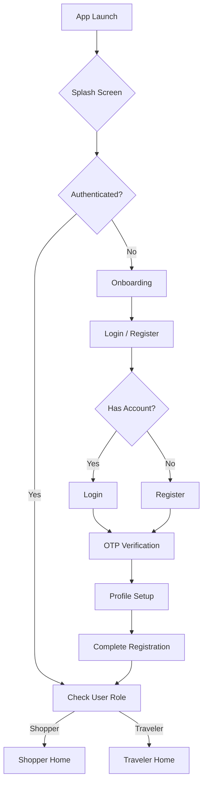
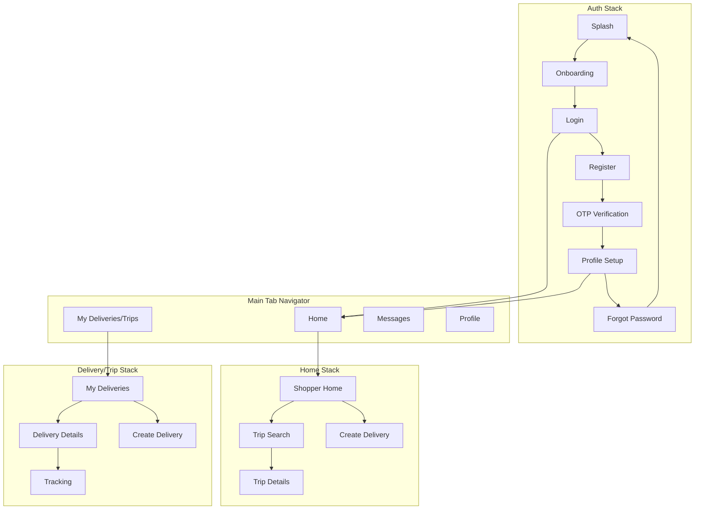

# Mnbara Mobile App - React Native Architecture Plan

## Document Information
- **Version**: 1.0.0
- **Date**: 2026-02-06
- **Technology**: React Native (Cross-platform iOS & Android)
- **Architecture**: Clean Architecture with MVVM pattern
- **Platform**: Crowdshipping Delivery App

---

## Table of Contents
1. [Project Overview](#1-project-overview)
2. [Architecture Design](#2-architecture-design)
3. [Project Structure](#3-project-structure)
4. [Authentication Flow](#4-authentication-flow)
5. [Core Screens & Features](#5-core-screens--features)
6. [API Integration](#6-api-integration)
7. [Navigation Structure](#7-navigation-structure)
8. [State Management](#8-state-management)
9. [Technical Requirements](#9-technical-requirements)
10. [Implementation Roadmap](#10-implementation-roadmap)

---

## 1. Project Overview

### 1.1 App Purpose
Mnbara Mobile App is a cross-platform React Native application for the Mnbara crowdshipping platform, connecting:
- **Shoppers**: Users seeking products from overseas
- **Travelers**: Users who can deliver items during their trips

### 1.2 Key Features
- User authentication with role-based access (Shopper/Traveler)
- Delivery request creation and management
- Traveler route posting and matching
- Real-time package tracking
- Secure payment processing
- In-app messaging
- Rating and review system
- Push notifications

### 1.3 Backend Services Integration
The app will integrate with existing backend services:
- `auth-service`: Authentication and authorization
- `crowdship-service`: Core crowdshipping functionality
- `trips-service`: Traveler trip management
- `location-service`: Geolocation and routing
- `payment-service`: Payment processing
- `notification-service`: Push notifications
- `chat-service`: In-app messaging
- `wallet-service`: User wallet management
- `matching-service`: AI-powered traveler-shopper matching

---

## 2. Architecture Design

### 2.1 Clean Architecture Layers

```
┌─────────────────────────────────────────────────────────────────┐
│                      PRESENTATION LAYER                         │
│  ┌─────────────────────────────────────────────────────────────┐│
│  │                    React Native Screens                     ││
│  │  ┌─────────────┐  ┌─────────────┐  ┌─────────────────────┐││
│  │  │ Components  │  │   Hooks     │  │     Navigation      │││
│  │  └─────────────┘  └─────────────┘  └─────────────────────┘││
│  └─────────────────────────────────────────────────────────────┘│
├─────────────────────────────────────────────────────────────────┤
│                      DOMAIN LAYER                               │
│  ┌─────────────────────────────────────────────────────────────┐│
│  │                    Use Cases / Interactors                 ││
│  │  ┌─────────────┐  ┌─────────────┐  ┌─────────────────────┐││
│  │  │  Auth Use   │  │  Delivery  │  │    Matching Use      │││
│  │  │    Cases    │  │    Cases   │  │       Cases         │││
│  │  └─────────────┘  └─────────────┘  └─────────────────────┘││
│  └─────────────────────────────────────────────────────────────┘│
│  ┌─────────────────────────────────────────────────────────────┐│
│  │                      Domain Entities                        ││
│  │  ┌──────────┐ ┌──────────┐ ┌──────────┐ ┌────────────────┐ ││
│  │  │  User    │ │ Delivery │ │  Trip    │ │    Message     │ ││
│  │  └──────────┘ └──────────┘ └──────────┘ └────────────────┘ ││
│  └─────────────────────────────────────────────────────────────┘│
├─────────────────────────────────────────────────────────────────┤
│                    DATA LAYER (Repository)                     │
│  ┌─────────────────────────────────────────────────────────────┐│
│  │                   Repository Implementations                 ││
│  │  ┌─────────────┐  ┌─────────────┐  ┌─────────────────────┐││
│  │  │  Auth Repo  │  │Delivery Repo│  │  Trip Repository    │││
│  │  └─────────────┘  └─────────────┘  └─────────────────────┘││
│  └─────────────────────────────────────────────────────────────┘│
├─────────────────────────────────────────────────────────────────┤
│                   INFRASTRUCTURE LAYER                         │
│  ┌─────────────────────────────────────────────────────────────┐│
│  │             API Client / Network Layer                      ││
│  │  ┌─────────────┐  ┌─────────────┐  ┌─────────────────────┐││
│  │  │  Axios/    │  │  Socket.IO │  │  Secure Storage     │││
│  │  │   Fetch    │  │   Client   │  │  (Keychain/Keystore)│││
│  │  └─────────────┘  └─────────────┘  └─────────────────────┘││
│  └─────────────────────────────────────────────────────────────┘│
└─────────────────────────────────────────────────────────────────┘
```

### 2.2 Technology Stack

| Category | Technology | Purpose |
|----------|-----------|---------|
| Framework | React Native (0.75+) | Cross-platform mobile development |
| Language | TypeScript 5.x | Type-safe JavaScript |
| Navigation | React Navigation 6.x | Native navigation with gestures |
| State Management | Redux Toolkit / Zustand | Global state management |
| API Client | Axios + React Query | HTTP requests + caching |
| Styling | NativeWind (Tailwind) | Utility-first styling |
| Forms | React Hook Form + Zod | Form validation |
| Maps | react-native-maps + Mapbox | Interactive maps |
| Location | react-native-geolocation-service | GPS tracking |
| Push Notifications | Firebase Cloud Messaging | Push notifications |
| Analytics | Firebase Analytics | User analytics |
| Crash Reporting | Sentry / Crashlytics | Error tracking |
| Storage | AsyncStorage + MMKV | Local storage |
| Secure Storage | react-native-keychain | Sensitive data |
| Icons | react-native-vector-icons / Lucide | Icon system |
| Image Handling | react-native-fast-image | Optimized images |
| Chat | Socket.IO Client | Real-time messaging |
| Animations | Reanimated 3 + Lottie | Smooth animations |
| Formatters | Intl.DateTimeFormat | Localization |

---

## 3. Project Structure

### 3.1 Directory Structure

```
mobile-app/
├── android/                          # Android native code
├── ios/                              # iOS native code
├── src/
│   ├── __tests__/                    # Test files
│   ├── assets/                       # Static assets
│   │   ├── fonts/                    # Custom fonts
│   │   ├── images/                   # Images and icons
│   │   ├── animations/               # Lottie animations
│   │   └── locales/                 # Translation files
│   │
│   ├── components/                   # Reusable UI components
│   │   ├── common/                   # Common components
│   │   │   ├── Button/
│   │   │   ├── Input/
│   │   │   ├── Card/
│   │   │   ├── Avatar/
│   │   │   ├── Badge/
│   │   │   ├── Modal/
│   │   │   ├── Loading/
│   │   │   ├── EmptyState/
│   │   │   └── ErrorBoundary/
│   │   │
│   │   ├── auth/                     # Auth-related components
│   │   │   ├── PasswordInput/
│   │   │   ├── PhoneInput/
│   │   │   └── RoleSelector/
│   │   │
│   │   ├── delivery/                 # Delivery components
│   │   │   ├── DeliveryCard/
│   │   │   ├── PackageInfo/
│   │   │   ├── TrackingMap/
│   │   │   ├── StatusBadge/
│   │   │   └── ProofOfDelivery/
│   │   │
│   │   ├── trip/                     # Trip components
│   │   │   ├── TripCard/
│   │   │   ├── RouteMap/
│   │   │   ├── TravelerInfo/
│   │   │   └── RouteVisualizer/
│   │   │
│   │   ├── chat/                     # Chat components
│   │   │   ├── MessageBubble/
│   │   │   ├── ChatInput/
│   │   │   └── ConversationItem/
│   │   │
│   │   ├── profile/                  # Profile components
│   │   │   ├── ProfileHeader/
│   │   │   ├── VerificationBadge/
│   │   │   ├── RatingStars/
│   │   │   └── StatsCard/
│   │   │
│   │   └── forms/                    # Form components
│   │       ├── DeliveryRequestForm/
│   │       ├── TripPostForm/
│   │       └── PaymentForm/
│   │
│   ├── config/                       # App configuration
│   │   ├── env.ts                    # Environment variables
│   │   ├── constants.ts              # App constants
│   │   ├── theme.ts                  # Theme configuration
│   │   └── api.ts                    # API configuration
│   │
│   ├── core/                         # Core utilities
│   │   ├── hooks/                    # Custom React hooks
│   │   │   ├── useAuth.ts
│   │   │   ├── useDelivery.ts
│   │   │   ├── useTrip.ts
│   │   │   ├── useLocation.ts
│   │   │   ├── useSocket.ts
│   │   │   └── useNotifications.ts
│   │   │
│   │   ├── utils/                    # Utility functions
│   │   │   ├── formatCurrency.ts
│   │   │   ├── formatDate.ts
│   │   │   ├── validation.ts
│   │   │   ├── helpers.ts
│   │   │   └── constants.ts
│   │   │
│   │   ├── services/                 # Service layer
│   │   │   ├── api.service.ts
│   │   │   ├── socket.service.ts
│   │   │   ├── storage.service.ts
│   │   │   └── analytics.service.ts
│   │   │
│   │   └── constants/                # Constants
│   │       ├── storageKeys.ts
│   │       ├── regexPatterns.ts
│   │       └── validationMessages.ts
│   │
│   ├── domain/                       # Domain layer (Clean Architecture)
│   │   ├── entities/                 # Domain entities
│   │   │   ├── user.entity.ts
│   │   │   ├── delivery.entity.ts
│   │   │   ├── trip.entity.ts
│   │   │   ├── message.entity.ts
│   │   │   ├── payment.entity.ts
│   │   │   └── notification.entity.ts
│   │   │
│   │   ├── repositories/             # Repository interfaces
│   │   │   ├── auth.repository.interface.ts
│   │   │   ├── delivery.repository.interface.ts
│   │   │   ├── trip.repository.interface.ts
│   │   │   └── user.repository.interface.ts
│   │   │
│   │   └── usecases/                 # Use cases / Interactors
│   │       ├── auth/
│   │       │   ├── login.usecase.ts
│   │       │   ├── register.usecase.ts
│   │       │   ├── logout.usecase.ts
│   │       │   └── refreshToken.usecase.ts
│   │       │
│   │       ├── delivery/
│   │       │   ├── createDelivery.usecase.ts
│   │       │   ├── getDeliveries.usecase.ts
│   │       │   ├── getDeliveryDetails.usecase.ts
│   │       │   └── cancelDelivery.usecase.ts
│   │       │
│   │       ├── trip/
│   │       │   ├── createTrip.usecase.ts
│   │       │   ├── getTrips.usecase.ts
│   │       │   └── updateTrip.usecase.ts
│   │       │
│   │       └── matching/
│   │           ├── matchDelivery.usecase.ts
│   │           └── getMatches.usecase.ts
│   │
│   ├── data/                         # Data layer
│   │   ├── repositories/             # Repository implementations
│   │   │   ├── auth.repository.ts
│   │   │   ├── delivery.repository.ts
│   │   │   ├── trip.repository.ts
│   │   │   └── user.repository.ts
│   │   │
│   │   ├── api/                      # API layer
│   │   │   ├── axios.client.ts
│   │   │   ├── endpoints.ts
│   │   │   └── interceptors.ts
│   │   │
│   │   └── mappers/                  # Data mappers
│   │       ├── user.mapper.ts
│   │       ├── delivery.mapper.ts
│   │       └── trip.mapper.ts
│   │
│   ├── features/                     # Feature modules
│   │   ├── auth/                     # Authentication feature
│   │   │   ├── screens/
│   │   │   │   ├── SplashScreen/
│   │   │   │   ├── OnboardingScreen/
│   │   │   │   ├── LoginScreen/
│   │   │   │   ├── RegisterScreen/
│   │   │   │   ├── ForgotPasswordScreen/
│   │   │   │   ├── OTPScreen/
│   │   │   │   └── ProfileSetupScreen/
│   │   │   │
│   │   │   ├── store/                # Feature state
│   │   │   │   ├── auth.slice.ts
│   │   │   │   └── auth.selectors.ts
│   │   │   │
│   │   │   └── navigation.tsx        # Feature navigation
│   │   │
│   │   ├── home/                     # Home feature
│   │   │   ├── screens/
│   │   │   │   ├── ShopperHomeScreen/
│   │   │   │   ├── TravelerHomeScreen/
│   │   │   │   └── DashboardScreen/
│   │   │   │
│   │   │   ├── store/
│   │   │   │   ├── home.slice.ts
│   │   │   │   └── home.selectors.ts
│   │   │   │
│   │   │   └── navigation.tsx
│   │   │
│   │   ├── delivery/                 # Delivery feature
│   │   │   ├── screens/
│   │   │   │   ├── CreateDeliveryScreen/
│   │   │   │   ├── DeliveryDetailsScreen/
│   │   │   │   ├── MyDeliveriesScreen/
│   │   │   │   ├── TrackingScreen/
│   │   │   │   ├── DeliverySuccessScreen/
│   │   │   │   └── RateDeliveryScreen/
│   │   │   │
│   │   │   ├── components/           # Feature-specific components
│   │   │   │
│   │   │   ├── store/
│   │   │   │   ├── delivery.slice.ts
│   │   │   │   └── delivery.selectors.ts
│   │   │   │
│   │   │   └── navigation.tsx
│   │   │
│   │   ├── trips/                    # Trips feature
│   │   │   ├── screens/
│   │   │   │   ├── CreateTripScreen/
│   │   │   │   ├── TripDetailsScreen/
│   │   │   │   ├── MyTripsScreen/
│   │   │   │   ├── TripRequestsScreen/
│   │   │   │   └── ActiveTripScreen/
│   │   │   │
│   │   │   ├── store/
│   │   │   │   ├── trip.slice.ts
│   │   │   │   └── trip.selectors.ts
│   │   │   │
│   │   │   └── navigation.tsx
│   │   │
│   │   ├── matching/                 # Matching feature
│   │   │   ├── screens/
│   │   │   │   ├── MatchingScreen/
│   │   │   │   ├── MatchDetailsScreen/
│   │   │   │   └── AcceptMatchScreen/
│   │   │   │
│   │   │   └── navigation.tsx
│   │   │
│   │   ├── chat/                     # Chat feature
│   │   │   ├── screens/
│   │   │   │   ├── ConversationsScreen/
│   │   │   │   └── ChatScreen/
│   │   │   │
│   │   │   ├── store/
│   │   │   │   ├── chat.slice.ts
│   │   │   │   └── chat.selectors.ts
│   │   │   │
│   │   │   └── navigation.tsx
│   │   │
│   │   ├── profile/                  # Profile feature
│   │   │   ├── screens/
│   │   │   │   ├── ProfileScreen/
│   │   │   │   ├── EditProfileScreen/
│   │   │   │   ├── SettingsScreen/
│   │   │   │   ├── VerificationScreen/
│   │   │   │   ├── PaymentMethodsScreen/
│   │   │   │   └── WalletScreen/
│   │   │   │
│   │   │   ├── store/
│   │   │   │   ├── profile.slice.ts
│   │   │   │   └── profile.selectors.ts
│   │   │   │
│   │   │   └── navigation.tsx
│   │   │
│   │   ├── wallet/                   # Wallet feature
│   │   │   ├── screens/
│   │   │   │   ├── WalletScreen/
│   │   │   │   ├── TransactionsScreen/
│   │   │   │   └── WithdrawScreen/
│   │   │   │
│   │   │   └── navigation.tsx
│   │   │
│   │   └── notifications/            # Notifications feature
│   │       ├── screens/
│   │       │   ├── NotificationsScreen/
│   │       │   └── NotificationSettingsScreen/
│   │       │
│   │       └── navigation.tsx
│   │
│   ├── navigation/                   # Root navigation
│   │   ├── AppNavigator.tsx
│   │   ├── RootStackParamList.ts
│   │   ├── BottomTabNavigator.tsx
│   │   ├── AuthNavigator.tsx
│   │   └── linking.ts                # Deep linking config
│   │
│   ├── store/                        # Root store
│   │   ├── index.ts
│   │   ├── rootReducer.ts
│   │   └── rootSaga.ts               # If using Redux Saga
│   │
│   ├── theme/                        # Theme system
│   │   ├── colors.ts
│   │   ├── typography.ts
│   │   ├── spacing.ts
│   │   ├── shadows.ts
│   │   ├── darkTheme.ts
│   │   └── index.ts
│   │
│   └── App.tsx                       # Root component
│
├── .env                              # Environment variables (local)
├── .env.example                      # Environment template
├── .eslintrc.js                      # ESLint config
├── .prettierrc                       # Prettier config
├── tsconfig.json                     # TypeScript config
├── babel.config.js                   # Babel config
├── metro.config.js                   # Metro bundler config
├── jest.config.js                    # Jest config
├── react-native.config.js            # React Native config
├── index.js                          # Entry point
└── app.json                          # App configuration
```

### 3.2 Key Files Description

| File | Purpose |
|------|---------|
| `App.tsx` | Root component, providers setup |
| `src/navigation/AppNavigator.tsx` | Main navigation container |
| `src/store/index.ts` | Redux store configuration |
| `src/config/env.ts` | Environment configuration |
| `src/theme/index.ts` | Theme provider and styles |

---

## 4. Authentication Flow

### 4.1 User Roles
- **Shopper**: Users who post delivery requests for packages
- **Traveler**: Users who offer to deliver packages during their trips

### 4.2 Authentication Screens

#### 4.2.1 Splash Screen
- App logo and branding
- Loading animation
- Auto-navigate based on auth state

#### 4.2.2 Onboarding Screens (3 slides)
1. **Slide 1**: "Shop Global" - Shop products from anywhere
2. **Slide 2**: "Earn While Traveling" - Monetize your trips
3. **Slide 3**: "Safe & Verified" - Community trust features

#### 4.2.3 Sign Up Screen
- Full name input
- Email input
- Phone number with country code
- Password with show/hide
- Confirm password
- Role selector: "I'm a Shopper" / "I'm a Traveler"
- Terms & conditions checkbox
- Social sign-up: Google, Facebook, Apple

#### 4.2.4 Login Screen
- Email/phone input
- Password with show/hide
- Remember me checkbox
- Forgot password link
- Social login options

#### 4.2.5 Forgot Password Screen
- Email/phone input
- Send reset link button

#### 4.2.6 OTP Verification Screen
- 6-digit OTP input
- Countdown timer (60s)
- Resend code option
- Verify button

#### 4.2.7 Profile Setup Screen (Post-signup)
- Profile photo upload (camera/gallery)
- Date of birth
- Gender selector
- Address/location
- Bio
- For Travelers: Vehicle details

### 4.3 Authentication State Flow



### 4.4 Session Management
- JWT token storage in secure storage
- Refresh token rotation
- Auto-logout on token expiration
- Biometric authentication option

---

## 5. Core Screens & Features

### 5.1 Shopper Features

#### 5.1.1 Shopper Home Screen
- Header with menu, logo, notifications
- Search/quick actions section
- Active delivery requests overview
- Recommended travelers
- Bottom navigation

#### 5.1.2 Create Delivery Request
- Package details form:
  - Item description
  - Category selection
  - Package size (small/medium/large/custom)
  - Weight
  - Photos upload
  - Estimated value
  - Special handling instructions

- Route information:
  - Pickup location (address autocomplete)
  - Delivery location (address autocomplete)
  - Preferred delivery date

- Pricing:
  - Budget/offer amount
  - Urgency level

#### 5.1.3 Browse Travelers / Matching
- Search available travelers by route
- Filter by:
  - Travel date
  - Price range
  - Traveler rating
  - Delivery speed

#### 5.1.4 Delivery Tracking
- Real-time map with traveler location
- ETA updates
- Status timeline
- Contact traveler

#### 5.1.5 Delivery Confirmation
- Proof of delivery verification
- Rate and review traveler
- Payment release

### 5.2 Traveler Features

#### 5.2.1 Traveler Home Screen
- Online/Offline toggle
- Today's earnings
- Available delivery requests nearby
- Active delivery card
- Post trip section

#### 5.2.2 Create Trip / Post Route
- Route details:
  - Starting point
  - Destination
  - Intermediate stops
  - Departure date/time
  - Available capacity

- Package preferences:
  - Max package size
  - Preferred categories
  - Price per delivery
  - Instant booking toggle

#### 5.2.3 Delivery Requests Screen
- Pending requests list
- Accept/Decline actions
- Request details view

#### 5.2.4 Active Delivery Screen
- Trip status indicator
- Package pickup/dropoff locations
- Navigation integration
- Package verification (QR/signature)
- Update delivery status

### 5.3 Common Features

#### 5.3.1 Messaging
- In-app chat between shopper/traveler
- Message history
- Share location
- Send delivery details

#### 5.3.2 Profile & Settings
- Edit profile
- Verification status
- Payment methods
- Wallet/earnings (travelers)
- Notification settings
- Privacy settings
- Language preference
- Support & help

#### 5.3.3 Ratings & Reviews
- Rate delivery partner
- Read reviews
- View ratings

---

## 6. API Integration

### 6.1 Backend Services Mapping

| Feature | Backend Service | Endpoint Base |
|---------|----------------|---------------|
| Auth | `auth-service` | `/api/auth` |
| Crowdship | `crowdship-service` | `/api/crowdship` |
| Trips | `trips-service` | `/api/trips` |
| Matching | `matching-service` | `/api/matching` |
| Location | `location-service` | `/api/location` |
| Payment | `payment-service` | `/api/payment` |
| Wallet | `wallet-service` | `/api/wallet` |
| Chat | `chat-service` | `/api/chat` |
| Notifications | `notification-service` | `/api/notifications` |
| Reviews | `review-service` | `/api/reviews` |

### 6.2 API Client Setup

```typescript
// src/data/api/axios.client.ts
import axios from 'axios';
import Config from 'react-native-config';
import { store } from '../../store';
import { logout } from '../../features/auth/store/auth.slice';

const apiClient = axios.create({
  baseURL: Config.API_BASE_URL,
  timeout: 30000,
  headers: {
    'Content-Type': 'application/json',
  },
});

// Request interceptor - Add auth token
apiClient.interceptors.request.use(
  async (config) => {
    const state = store.getState();
    const token = state.auth.accessToken;
    
    if (token) {
      config.headers.Authorization = `Bearer ${token}`;
    }
    
    return config;
  },
  (error) => Promise.reject(error)
);

// Response interceptor - Handle token refresh
apiClient.interceptors.response.use(
  (response) => response,
  async (error) => {
    const originalRequest = error.config;
    
    if (error.response?.status === 401 && !originalRequest._retry) {
      originalRequest._retry = true;
      
      try {
        await store.dispatch(refreshToken()).unwrap();
        return apiClient(originalRequest);
      } catch (refreshError) {
        store.dispatch(logout());
        return Promise.reject(refreshError);
      }
    }
    
    return Promise.reject(error);
  }
);

export default apiClient;
```

### 6.3 API Endpoints

#### Authentication
```typescript
export const AUTH_ENDPOINTS = {
  LOGIN: '/auth/login',
  REGISTER: '/auth/register',
  LOGOUT: '/auth/logout',
  REFRESH_TOKEN: '/auth/refresh-token',
  FORGOT_PASSWORD: '/auth/forgot-password',
  RESET_PASSWORD: '/auth/reset-password',
  VERIFY_OTP: '/auth/verify-otp',
  RESEND_OTP: '/auth/resend-otp',
};
```

#### Deliveries (Shopper)
```typescript
export const DELIVERY_ENDPOINTS = {
  CREATE: '/deliveries',
  LIST: '/deliveries',
  DETAILS: (id: string) => `/deliveries/${id}`,
  UPDATE: (id: string) => `/deliveries/${id}`,
  CANCEL: (id: string) => `/deliveries/${id}/cancel`,
  TRACK: (id: string) => `/deliveries/${id}/tracking`,
  CONFIRM: (id: string) => `/deliveries/${id}/confirm`,
  RATE: (id: string) => `/deliveries/${id}/rate`,
};
```

#### Trips (Traveler)
```typescript
export const TRIP_ENDPOINTS = {
  CREATE: '/trips',
  LIST: '/trips',
  DETAILS: (id: string) => `/trips/${id}`,
  UPDATE: (id: string) => `/trips/${id}`,
  DELETE: (id: string) => `/trips/${id}`,
  ACTIVATE: (id: string) => `/trips/${id}/activate`,
  COMPLETE: (id: string) => `/trips/${id}/complete`,
};
```

#### Matching
```typescript
export const MATCHING_ENDPOINTS = {
  SEARCH: '/matching/search',
  MATCHES: '/matching/matches',
  ACCEPT: (id: string) => `/matching/${id}/accept`,
  DECLINE: (id: string) => `/matching/${id}/decline`,
  PROPOSE: '/matching/propose',
};
```

### 6.4 WebSocket Integration

```typescript
// Real-time updates for tracking and chat
import io from 'socket.io-client';

class SocketService {
  private socket: SocketIOClient.Socket | null = null;
  private token: string | null = null;
  
  connect(token: string) {
    this.token = token;
    this.socket = io(Config.SOCKET_URL, {
      auth: { token },
      transports: ['websocket'],
    });
    
    this.socket.on('connect', () => {
      console.log('Socket connected');
    });
    
    this.socket.on('disconnect', () => {
      console.log('Socket disconnected');
    });
    
    return this.socket;
  }
  
  // Delivery tracking events
  subscribeToDelivery(deliveryId: string) {
    this.socket?.emit('subscribe:delivery', { deliveryId });
  }
  
  onDeliveryUpdate(callback: (data: any) => void) {
    this.socket?.on('delivery:update', callback);
  }
  
  // Chat events
  joinConversation(conversationId: string) {
    this.socket?.emit('join:conversation', { conversationId });
  }
  
  sendMessage(conversationId: string, message: string) {
    this.socket?.emit('message:send', { conversationId, message });
  }
  
  onNewMessage(callback: (data: any) => void) {
    this.socket?.on('message:new', callback);
  }
  
  disconnect() {
    this.socket?.disconnect();
    this.socket = null;
  }
}

export const socketService = new SocketService();
```

---

## 7. Navigation Structure

### 7.1 Navigation Stack



### 7.2 Navigation Configuration

```typescript
// src/navigation/RootStackParamList.ts
export type RootStackParamList = {
  // Auth
  Splash: undefined;
  Onboarding: undefined;
  Login: undefined;
  Register: undefined;
  ForgotPassword: undefined;
  OTPVerification: { email?: string; phone?: string };
  ProfileSetup: { role: 'shopper' | 'traveler' };
  
  // Main Tabs
  Home: undefined;
  MyDeliveries: undefined;
  Messages: undefined;
  Profile: undefined;
  
  // Home Stack
  ShopperHome: undefined;
  TravelerHome: undefined;
  SearchTrips: { origin?: string; destination?: string };
  CreateDelivery: undefined;
  TripDetails: { tripId: string };
  
  // Delivery Stack
  MyDeliveriesList: undefined;
  DeliveryDetails: { deliveryId: string };
  CreateDeliveryRequest: undefined;
  Tracking: { deliveryId: string };
  DeliveryConfirmation: { deliveryId: string };
  
  // Trip Stack
  MyTripsList: undefined;
  TripDetails: { tripId: string };
  CreateTrip: undefined;
  TripRequests: { tripId: string };
  ActiveTrip: { tripId: string };
  
  // Matching
  MatchingResults: { deliveryId: string };
  MatchDetails: { matchId: string };
  AcceptMatch: { matchId: string };
  
  // Chat
  Conversations: undefined;
  Chat: { conversationId: string };
  
  // Profile
  ProfileScreen: undefined;
  EditProfile: undefined;
  Settings: undefined;
  Verification: undefined;
  PaymentMethods: undefined;
  Wallet: undefined;
  NotificationsSettings: undefined;
  
  // Common
  WebView: { url: string; title: string };
  ImagePreview: { uri: string };
};
```

### 7.3 Bottom Tab Navigation

```typescript
// Bottom tabs configuration
const bottomTabNavigator = () => {
  return (
    <Tab.Navigator
      screenOptions={({ route }) => ({
        tabBarIcon: ({ focused, color, size }) => {
          const icons = {
            Home: focused ? 'home' : 'home-outline',
            MyDeliveries: focused ? 'package' : 'package-outline',
            Messages: focused ? 'chat' : 'chat-outline',
            Profile: focused ? 'person' : 'person-outline',
          };
          
          return <Icon name={icons[route.name]} size={size} color={color} />;
        },
        tabBarActiveTintColor: theme.colors.primary,
        tabBarInactiveTintColor: theme.colors.gray,
        headerShown: false,
      })}
    >
      <Tab.Screen name="Home" component={HomeNavigator} />
      <Tab.Screen name="MyDeliveries" component={DeliveriesNavigator} />
      <Tab.Screen name="Messages" component={MessagesNavigator} />
      <Tab.Screen name="Profile" component={ProfileNavigator} />
    </Tab.Navigator>
  );
};
```

### 7.4 Deep Linking

```typescript
// src/navigation/linking.ts
const linking = {
  prefixes: ['mnbara://', 'https://mnbara.app'],
  config: {
    screens: {
      Splash: '',
      Login: 'login',
      Register: 'register',
      Home: 'home',
      DeliveryDetails: 'delivery/:deliveryId',
      TripDetails: 'trip/:tripId',
      Tracking: 'track/:deliveryId',
      Profile: 'profile',
      Chat: 'chat/:conversationId',
      Notifications: 'notifications',
      WebView: 'web/:title',
    },
  },
};

export default linking;
```

---

## 8. State Management

### 8.1 State Architecture (Redux Toolkit)

```
Store Structure
├── auth
│   ├── user
│   ├── accessToken
│   ├── refreshToken
│   ├── isAuthenticated
│   ├── role
│   └── loading/error
│
├── delivery
│   ├── currentDelivery
│   ├── deliveriesList
│   ├── createDelivery
│   └── tracking
│
├── trip
│   ├── currentTrip
│   ├── tripsList
│   ├── activeTrip
│   └── requests
│
├── chat
│   ├── conversations
│   ├── currentChat
│   └── messages
│
├── profile
│   ├── userProfile
│   ├── wallet
│   ├── paymentMethods
│   └── verification
│
├── notifications
│   ├── notificationsList
│   └── unreadCount
│
└── app
    ├── isOnline
    ├── currentRoute
    └── theme
```

### 8.2 Redux Slice Example

```typescript
// src/features/delivery/store/delivery.slice.ts
import { createSlice, createAsyncThunk } from '@reduxjs/toolkit';
import { deliveryRepository } from '../../../data/repositories/delivery.repository';
import { Delivery, DeliveryStatus } from '../../../domain/entities/delivery.entity';

interface DeliveryState {
  currentDelivery: Delivery | null;
  deliveriesList: Delivery[];
  createDelivery: {
    loading: boolean;
    error: string | null;
  };
  tracking: {
    currentLocation: { lat: number; lng: number } | null;
    status: DeliveryStatus | null;
    eta: number | null;
  };
  loading: boolean;
  error: string | null;
}

const initialState: DeliveryState = {
  currentDelivery: null,
  deliveriesList: [],
  createDelivery: {
    loading: false,
    error: null,
  },
  tracking: {
    currentLocation: null,
    status: null,
    eta: null,
  },
  loading: false,
  error: null,
};

// Async thunks
export const fetchDeliveries = createAsyncThunk(
  'delivery/fetchAll',
  async (filters?: DeliveryFilters, { rejectWithValue }) => {
    try {
      return await deliveryRepository.getDeliveries(filters);
    } catch (error) {
      return rejectWithValue((error as Error).message);
    }
  }
);

export const createDelivery = createAsyncThunk(
  'delivery/create',
  async (data: CreateDeliveryDTO, { rejectWithValue }) => {
    try {
      return await deliveryRepository.createDelivery(data);
    } catch (error) {
      return rejectWithValue((error as Error).message);
    }
  }
);

const deliverySlice = createSlice({
  name: 'delivery',
  initialState,
  reducers: {
    setCurrentDelivery: (state, action) => {
      state.currentDelivery = action.payload;
    },
    updateTracking: (state, action) => {
      state.tracking = { ...state.tracking, ...action.payload };
    },
    clearError: (state) => {
      state.error = null;
    },
  },
  extraReducers: (builder) => {
    builder
      .addCase(fetchDeliveries.pending, (state) => {
        state.loading = true;
      })
      .addCase(fetchDeliveries.fulfilled, (state, action) => {
        state.loading = false;
        state.deliveriesList = action.payload;
      })
      .addCase(fetchDeliveries.rejected, (state, action) => {
        state.loading = false;
        state.error = action.payload as string;
      })
      .addCase(createDelivery.pending, (state) => {
        state.createDelivery.loading = true;
        state.createDelivery.error = null;
      })
      .addCase(createDelivery.fulfilled, (state, action) => {
        state.createDelivery.loading = false;
        state.deliveriesList.unshift(action.payload);
      })
      .addCase(createDelivery.rejected, (state, action) => {
        state.createDelivery.loading = false;
        state.createDelivery.error = action.payload as string;
      });
  },
});

export const { setCurrentDelivery, updateTracking, clearError } = deliverySlice.actions;
export default deliverySlice.reducer;
```

### 8.3 Custom Hooks

```typescript
// src/core/hooks/useDelivery.ts
import { useDispatch, useSelector } from 'react-redux';
import { RootState } from '../../store';
import { 
  fetchDeliveries, 
  createDelivery, 
  selectDeliveryList, 
  selectCurrentDelivery,
  selectDeliveryLoading,
} from '../../features/delivery/store/delivery.slice';

export const useDelivery = () => {
  const dispatch = useDispatch();
  
  const deliveries = useSelector((state: RootState) => selectDeliveryList(state));
  const currentDelivery = useSelector((state: RootState) => selectCurrentDelivery(state));
  const loading = useSelector((state: RootState) => selectDeliveryLoading(state));
  
  const getDeliveries = async (filters?: DeliveryFilters) => {
    await dispatch(fetchDeliveries(filters) as any);
  };
  
  const createNewDelivery = async (data: CreateDeliveryDTO) => {
    await dispatch(createDelivery(data) as any);
  };
  
  return {
    deliveries,
    currentDelivery,
    loading,
    getDeliveries,
    createNewDelivery,
  };
};
```

---

## 9. Technical Requirements

### 9.1 Dependencies

```json
{
  "dependencies": {
    "react": "18.2.0",
    "react-native": "0.75.0",
    "@react-navigation/native": "^6.1.9",
    "@react-navigation/native-stack": "^6.9.17",
    "@react-navigation/bottom-tabs": "^6.5.11",
    "@react-navigation/drawer": "^6.6.6",
    "@react-native-community/masked-view": "^0.1.11",
    "@react-native-google-signin/google-signin": "^11.0.0",
    "@react-native-firebase/app": "^19.0.0",
    "@react-native-firebase/auth": "^19.0.0",
    "@react-native-firebase/messaging": "^19.0.0",
    "@reduxjs/toolkit": "^2.0.0",
    "react-redux": "^9.0.0",
    "axios": "^1.6.0",
    "socket.io-client": "^4.7.0",
    "react-hook-form": "^7.49.0",
    "zod": "^3.22.0",
    "@hookform/resolvers": "^3.3.0",
    "react-native-maps": "^1.8.0",
    "react-native-geolocation-service": "^5.3.1",
    "@react-native-community/geolocation": "^3.1.0",
    "@react-native-async-storage/async-storage": "^1.21.0",
    "react-native-keychain": "^8.1.0",
    "react-native-safe-area-context": "^4.8.0",
    "react-native-screens": "^3.29.0",
    "react-native-gesture-handler": "^2.14.0",
    "react-native-reanimated": "^3.6.0",
    "lottie-react-native": "^6.5.0",
    "react-native-fast-image": "^8.6.0",
    "date-fns": "^3.0.0",
    "intl": "^1.2.5",
    "react-native-config": "^1.5.1",
    "axios-auth-refresh": "^3.3.0",
    "react-native-image-picker": "^7.1.0",
    "react-native-document-picker": "^9.1.0",
    "rn-fetch-blob": "^0.12.0"
  },
  "devDependencies": {
    "@types/react": "^18.2.0",
    "@types/react-native": "^0.73.0",
    "@types/node": "^20.10.0",
    "typescript": "^5.3.0",
    "jest": "^29.7.0",
    "@testing-library/react-native": "^12.4.0",
    "eslint": "^8.55.0",
    "prettier": "^3.1.0"
  }
}
```

### 9.2 Platform-Specific Configuration

#### iOS (Info.plist)
```xml
<key>NSCameraUsageDescription</key>
<string>Mnbara needs camera access to take package photos</string>
<key>NSPhotoLibraryUsageDescription</key>
<string>Mnbara needs photo library access to upload package images</string>
<key>NSLocationWhenInUseUsageDescription</key>
<string>Mnbara needs your location to show nearby deliveries and track your route</string>
<key>NSLocationAlwaysAndWhenInUseUsageDescription</key>
<string>Mnbara needs continuous location access to track deliveries in real-time</string>
<key>NSPhotoLibraryAddUsageDescription</key>
<string>Mnbara needs permission to save delivery proof photos</string>
<key>NSUserNotificationUsageDescription</key>
<string>Mnbara uses notifications to update you on delivery status</string>
```

#### Android (AndroidManifest.xml)
```xml
<uses-permission android:name="android.permission.INTERNET" />
<uses-permission android:name="android.permission.ACCESS_NETWORK_STATE" />
<uses-permission android:name="android.permission.CAMERA" />
<uses-permission android:name="android.permission.READ_EXTERNAL_STORAGE" android:maxSdkVersion="32" />
<uses-permission android:name="android.permission.WRITE_EXTERNAL_STORAGE" android:maxSdkVersion="28" />
<uses-permission android:name="android.permission.READ_MEDIA_IMAGES" />
<uses-permission android:name="android.permission.ACCESS_FINE_LOCATION" />
<uses-permission android:name="android.permission.ACCESS_COARSE_LOCATION" />
<uses-permission android:name="android.permission.ACCESS_BACKGROUND_LOCATION" />
<uses-permission android:name="android.permission.FOREGROUND_SERVICE" />
<uses-permission android:name="android.permission.POST_NOTIFICATIONS" />
<uses-permission android:name="android.permission.RECEIVE_BOOT_COMPLETED" />
<uses-permission android:name="android.permission.VIBRATE" />
```

### 9.3 Environment Configuration

```typescript
// .env.example
# API Configuration
API_BASE_URL=https://api.mnbara.com/v1
SOCKET_URL=wss://socket.mnbara.com

# Firebase
FIREBASE_API_KEY=xxx
FIREBASE_AUTH_DOMAIN=mnbara.firebaseapp.com
FIREBASE_PROJECT_ID=mnbara-xxx
FIREBASE_STORAGE_BUCKET=mnbara-xxx.appspot.com
FIREBASE_MESSAGING_SENDER_ID=xxx
FIREBASE_APP_ID=xxx

# Google Maps (iOS)
GOOGLE_MAPS_IOS_API_KEY=xxx

# Google Maps (Android)
GOOGLE_MAPS_ANDROID_API_KEY=xxx

# App Configuration
APP_ENV=development
STRIPE_PUBLISHABLE_KEY=pk_test_xxx
```

### 9.4 Security Requirements

1. **Token Storage**: Use Keychain (iOS) / Keystore (Android)
2. **Certificate Pinning**: Enable for production builds
3. **Obfuscation**: Enable ProGuard/R8 for Android
4. **Debug Protection**: Disable debug features in release
5. **Root/Jailbreak Detection**: Prevent running on compromised devices
6. **SSL/TLS**: Enforce HTTPS connections

### 9.5 Performance Requirements

| Metric | Target |
|--------|--------|
| App Launch Time | < 3 seconds |
| Screen Transition | < 300ms |
| API Response Time | < 2 seconds (95th percentile) |
| Memory Usage | < 100MB (idle) |
| Battery Impact | Minimal background location |
| Crash Rate | < 0.1% |

---

## 10. Implementation Roadmap

### Phase 1: Project Setup & Authentication

**Duration**: 2-3 days

| Task | Description | Estimated Time |
|------|-------------|----------------|
| 1.1 | Initialize React Native project with TypeScript | 2 hours |
| 1.2 | Configure project structure (Clean Architecture) | 4 hours |
| 1.3 | Set up dependencies and dev tools | 2 hours |
| 1.4 | Configure environment files | 1 hour |
| 1.5 | Implement API client with interceptors | 4 hours |
| 1.6 | Create Redux store and auth slice | 4 hours |
| 1.7 | Build Splash and Onboarding screens | 4 hours |
| 1.8 | Build Login and Register screens | 8 hours |
| 1.9 | Implement OTP verification | 4 hours |
| 1.10 | Build Profile Setup screen | 4 hours |
| 1.11 | Implement session management | 4 hours |
| 1.12 | Social login integration (Google, Facebook) | 8 hours |
| 1.13 | Unit tests for auth | 4 hours |

**Deliverables**:
- ✅ Complete project structure
- ✅ Working authentication flow
- ✅ Role-based navigation
- ✅ Unit tests

### Phase 2: Core Screens & Navigation

**Duration**: 3-4 days

| Task | Description | Estimated Time |
|------|-------------|----------------|
| 2.1 | Configure navigation structure | 4 hours |
| 2.2 | Build bottom tab navigation | 4 hours |
| 2.3 | Build Shopper Home screen | 8 hours |
| 2.4 | Build Traveler Home screen | 8 hours |
| 2.5 | Create reusable UI components library | 8 hours |
| 2.6 | Implement theme system | 4 hours |
| 2.7 | Build Settings screen | 4 hours |
| 2.8 | Build Profile screen | 6 hours |
| 2.9 | Implement deep linking | 4 hours |
| 2.10 | Accessibility compliance | 4 hours |
| 2.11 | Unit tests | 4 hours |

**Deliverables**:
- ✅ Navigation structure
- ✅ Home screens for both roles
- ✅ Common components library
- ✅ Theme system

### Phase 3: Delivery Management (Shopper)

**Duration**: 4-5 days

| Task | Description | Estimated Time |
|------|-------------|----------------|
| 3.1 | Build Create Delivery form | 8 hours |
| 3.2 | Implement package details upload | 6 hours |
| 3.3 | Build location picker with autocomplete | 6 hours |
| 3.4 | Create My Deliveries list screen | 6 hours |
| 3.5 | Build Delivery Details screen | 6 hours |
| 3.6 | Implement delivery filtering | 4 hours |
| 3.7 | Connect to crowdship-service API | 6 hours |
| 3.8 | Build Confirmation screen | 4 hours |
| 3.9 | Rate & Review screen | 4 hours |
| 3.10 | Integration tests | 8 hours |

**Deliverables**:
- ✅ Create delivery requests
- ✅ View and manage deliveries
- ✅ Delivery details with status tracking
- ✅ Rating system

### Phase 4: Trip Management (Traveler)

**Duration**: 4-5 days

| Task | Description | Estimated Time |
|------|-------------|----------------|
| 4.1 | Build Create Trip form | 8 hours |
| 4.2 | Implement route visualization | 6 hours |
| 4.3 | Create My Trips list screen | 6 hours |
| 4.4 | Build Trip Details screen | 6 hours |
| 4.5 | Implement trip requests management | 8 hours |
| 4.6 | Build Active Trip screen | 8 hours |
| 4.7 | Connect to trips-service API | 6 hours |
| 4.8 | Implement status updates | 4 hours |
| 4.9 | Integration tests | 8 hours |

**Deliverables**:
- ✅ Post trips/routes
- ✅ Manage trip requests
- ✅ Active trip tracking
- ✅ Status updates

### Phase 5: Matching & Search

**Duration**: 3-4 days

| Task | Description | Estimated Time |
|------|-------------|----------------|
| 5.1 | Build traveler search/browse screen | 8 hours |
| 5.2 | Implement matching results list | 6 hours |
| 5.3 | Create Match Details screen | 6 hours |
| 5.4 | Implement matching algorithm UI | 8 hours |
| 5.5 | Connect to matching-service API | 6 hours |
| 5.6 | Build Accept/Decline actions | 4 hours |
| 5.7 | Integration tests | 6 hours |

**Deliverables**:
- ✅ Browse available travelers
- ✅ Matching results
- ✅ Accept/decline functionality
- ✅ Match details view

### Phase 6: Real-time Features

**Duration**: 3-4 days

| Task | Description | Estimated Time |
|------|-------------|----------------|
| 6.1 | Implement Socket.IO connection | 4 hours |
| 6.2 | Build real-time tracking | 8 hours |
| 6.3 | Create Conversations list | 6 hours |
| 6.4 | Build Chat screen | 8 hours |
| 6.5 | Implement push notifications | 8 hours |
| 6.6 | Build Notifications screen | 4 hours |
| 6.7 | Location tracking service | 6 hours |
| 6.8 | Integration tests | 6 hours |

**Deliverables**:
- ✅ Real-time tracking
- ✅ In-app messaging
- ✅ Push notifications
- ✅ Live updates

### Phase 7: Payments & Wallet

**Duration**: 2-3 days

| Task | Description | Estimated Time |
|------|-------------|----------------|
| 7.1 | Build Payment Methods screen | 6 hours |
| 7.2 | Implement Add Payment form | 4 hours |
| 7.3 | Create Wallet screen (Travelers) | 6 hours |
| 7.4 | Build Transactions history | 4 hours |
| 7.5 | Connect to wallet-service API | 6 hours |
| 7.6 | Integration tests | 4 hours |

**Deliverables**:
- ✅ Payment methods management
- ✅ Wallet for travelers
- ✅ Transaction history

### Phase 8: Polish & Optimization

**Duration**: 2-3 days

| Task | Description | Estimated Time |
|------|-------------|----------------|
| 8.1 | Performance optimization | 8 hours |
| 8.2 | Memory leak fixes | 4 hours |
| 8.3 | Animations and transitions polish | 8 hours |
| 8.4 | Error handling and fallbacks | 6 hours |
| 8.5 | Loading states and skeleton screens | 4 hours |
| 8.6 | Accessibility audit | 4 hours |
| 8.7 | Beta testing coordination | 4 hours |
| 8.8 | Bug fixes | 8 hours |

**Deliverables**:
- ✅ Optimized performance
- ✅ Smooth animations
- ✅ Accessible UI
- ✅ Production-ready

### Total Estimated Timeline

| Phase | Duration | Status |
|-------|----------|--------|
| Phase 1: Project Setup & Auth | 2-3 days | ⏳ Pending |
| Phase 2: Core Screens & Nav | 3-4 days | ⏳ Pending |
| Phase 3: Delivery (Shopper) | 4-5 days | ⏳ Pending |
| Phase 4: Trip Management (Traveler) | 4-5 days | ⏳ Pending |
| Phase 5: Matching & Search | 3-4 days | ⏳ Pending |
| Phase 6: Real-time Features | 3-4 days | ⏳ Pending |
| Phase 7: Payments & Wallet | 2-3 days | ⏳ Pending |
| Phase 8: Polish & Optimization | 2-3 days | ⏳ Pending |
| **Total** | **23-31 days** | |

---

## 11. Testing Strategy

### 11.1 Testing Pyramid

```
                    ┌─────────────────┐
                    │   E2E Tests     │  (5%)
                    │  (Detox)        │
               ┌────┴─────────────────┴────┐
               │      Integration Tests      │  (25%)
               │    (React Native Testing)   │
          ┌────┴─────────────────────────┴────┐
          │        Unit Tests                │  (70%)
          │      (Jest + Testing Library)    │
     ┌────┴─────────────────────────────────┘
     │
     ▼
┌─────────────────────────────────────────┐
│       Component & Hook Tests            │
└─────────────────────────────────────────┘
```

### 11.2 Test Coverage Requirements

| Category | Target Coverage |
|----------|-----------------|
| Unit Tests | 80% |
| Integration Tests | 60% |
| E2E Tests | Critical paths only |
| Overall | 70% |

---

## 12. Deployment Strategy

### 12.1 Build Configuration

#### Development
```bash
npm run android:dev
# or
npm run ios:dev
```

#### Staging
```bash
npm run android:staging
# or
npm run ios:staging
```

#### Production
```bash
npm run android:release
# or
npm run ios:release
```

### 12.2 App Store Submission

**iOS (App Store Connect)**
- Apple Developer Program enrollment
- App Store assets (icons, screenshots, descriptions)
- Privacy policy URL
- TestFlight beta testing

**Google Play Store**
- Google Play Developer Console
- Store listing (icons, screenshots, descriptions)
- Privacy policy
- Internal/Closed testing tracks

---

## 13. Risk Assessment

| Risk | Impact | Mitigation |
|------|--------|------------|
| API integration delays | High | Mock services for development |
| Real-time features complexity | Medium | Progressive implementation |
| Platform-specific issues | Medium | Comprehensive testing |
| Performance with maps | Medium | Optimization and caching |
| Security vulnerabilities | High | Security audits, penetration testing |
| User adoption | High | UX research, beta testing |

---

## 14. Success Metrics

| Metric | Target |
|--------|--------|
| App Store Rating | 4.5+ stars |
| Crash-free Sessions | 99.5% |
| API Success Rate | 99% |
| Push Notification Open Rate | 40% |
| User Retention (30-day) | 40% |
| Feature Completion | 100% |

---

## 15. Next Steps

1. **Review and approve** this architecture plan
2. **Initialize** React Native project
3. **Set up** development environment
4. **Begin Phase 1**: Project Setup & Authentication
5. **Establish** CI/CD pipeline
6. **Start** regular code reviews
7. **Begin** beta testing program

---

*Document created: 2026-02-06*
*Version: 1.0.0*
